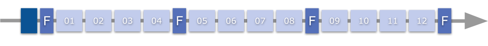
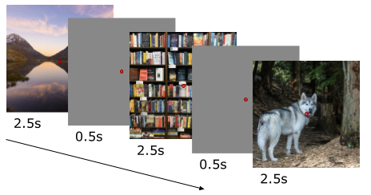

===================
Experimental Design
===================

.. todo::

   Introductory narrative (3-4 sentences): What is the overall design
   philosophy? How many sessions per subject, what is the general flow of a
   participant through the study? Link to the dataset paper for full details.

Experiments
===========

.. todo::

   Fill in the experiment overview table below. Add or remove rows as needed.

.. list-table::
   :widths: 20 30 50
   :header-rows: 1

   * - Experiment
     - Design type
     - Purpose
   * - (placeholder)
     - (placeholder)
     - (placeholder)

Main Experiment
===============

.. todo::

   Narrative (3-5 sentences): What are participants doing and why (passive
   viewing, one-back, categorization)? How were stimuli assigned to runs and
   sessions? How many images are seen once vs repeated — this is critical for
   GLMsingle users. Cross-reference :doc:`stimulus_data` for stimulus details
   and :doc:`train_test_splits` for how images are split.

Session Structure
-----------------

.. todo::

   Fill in the actual session structure below.

.. code-block:: text

    Session Structure (placeholder):
    └── ...

   Session structure overview.

Run Parameters
--------------

.. todo::

   Fill in run parameters.

.. list-table::
   :widths: 30 70
   :stub-columns: 1

   * - Duration per run
     - (placeholder)
   * - Trials per run
     - (placeholder)
   * - Runs per session
     - (placeholder)
   * - Total runs
     - (placeholder)

.. note::

   For MRI acquisition parameters (TR, voxel size, etc.), see
   :doc:`mri_acquisition`.

Trial Structure
---------------

.. todo::

   Add a trial structure figure (timeline diagram showing fixation, stimulus,
   response window, ITI). Replace the ASCII placeholder below once available.

.. figure:: _static/placeholder_trial_structure.png
   :align: center
   :width: 70%
   :alt: Trial structure timeline

   Trial structure for the main experiment. *(placeholder — replace with
   actual figure)*

Stimulus Presentation
---------------------

.. todo::

   Fill in stimulus presentation details.

.. list-table::
   :widths: 30 70
   :stub-columns: 1

   * - Software
     - (placeholder)
   * - Display
     - (placeholder)
   * - Resolution
     - (placeholder)
   * - Refresh rate
     - (placeholder)
   * - Viewing distance
     - (placeholder)
   * - Scanner synchronization
     - (placeholder — e.g. TTL trigger, volume logging)

Localizer Experiment
====================

.. todo::

   Narrative + parameters: Which categories were used? Block duration,
   number of blocks per category, total duration. What was the task
   (one-back on images)? Cross-reference :doc:`localizers` for the resulting
   contrast maps.

   Task design overview.

Retinotopy Experiment
=====================

.. todo::

   What paradigm was used (rotating wedge, expanding ring, bars)?
   Duration, number of runs. Cross-reference :doc:`retinotopy` for the
   resulting maps.

Behavioral Data
===============

.. todo::

   Document:

   - What behavioral measures are available (accuracy, RT, etc.)?
   - Are there summary statistics, or only trial-level data in events files?
   - Show the actual columns from ``*_events.tsv`` (copy a few rows)
   - Cross-reference :doc:`fmri_data` for file locations
