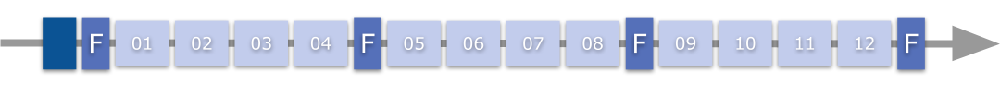
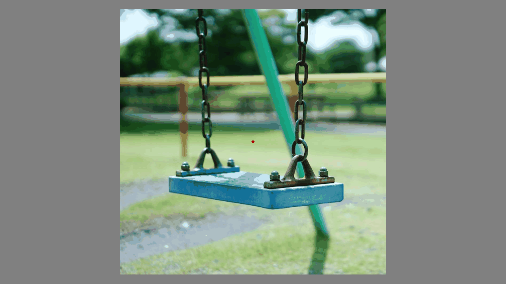

===================
Experimental Design
===================

The LAION-fMRI dataset uses a dense-sampling design: a small number of
participants are scanned across many sessions, each seeing on the order of
6,000 unique natural images. The general logic follows dense sampling designs (few
subjects, many sessions, controlled image repetitions for noise ceiling
estimation), but with a broader image set based on LAION-natural (derived from
LAION-2B, Roth & Hebart, 2025) that goes beyond standard scene or object
datasets. Each of the 5 participants completed 30 main sessions of image
viewing, one eyetracking session (ses-31), and 3 supplemental fMRI sessions
after a time gap of about half a year. The launch release focuses on the 30
main image-viewing sessions per participant; the supplemental sessions and
their additional shared images will be released later. Counting all acquired
fMRI sessions gives 165 sessions (33 per participant), plus 5 eyetracking
sessions. In total, the recording took place over the course of about 1.5
years (Nov 2024 to Mar 2026) at the Max Planck Institute for Human Cognitive
and Brain Sciences in Leipzig, Germany.

Experiments
===========

.. list-table::
   :widths: 20 30 50
   :header-rows: 1

   * - Experiment
     - Design type
     - Purpose
   * - Main image viewing (``task-images``, ses-01 to ses-30)
     - Event-related, single trials
     - Single-trial responses to ~6,100 natural images per subject
   * - Eyetracking session (ses-31)
     - Mixed (calibration + image viewing + localizer + deepmreye)
     - Independent test set with concurrent eyetracking that includes
       ``task-deepmreye`` (4 runs), ``task-images`` (4 runs),
       ``task-oloc`` (8 runs)

.. todo::

   Do controversial stimuli need their own row in the table?

.. todo::

   Localizer: should it be listed as a separate experiment, or only as a
   sub-task of ses-31?

.. todo::

   Add retinotopy tasks to the table?

.. todo::

   Add diffusion tasks to the table?

Main Experiment
===============

In the main experiment (ses-01 to ses-30), participants viewed natural images
while performing a continuous recognition task ("Have you seen this image
before?"). On each trial participants pressed a button to indicate whether the
image was new (first presentation) or old (already seen in a previous trial or
session) with their right index finger. The task keeps participants attentive
during long sessions and yields behavioural data on memory performance; the
primary purpose of the experiment is to obtain reliable single-trial BOLD
responses to each image.

Each subject saw around 6,204 unique images across roughly 31,856 image
presentations, plus around 2,583 blank trials. The image set is split into
shared and subject-unique images. The 1,492 shared images are common to all
subjects: 881 of them are shown 12 times (the 12-repeat set, used for noise
ceiling estimation) and 611 are shown 4 times (the 4-repeat set). The
remaining 4,712 unique images per subject are shown 4 times each and are
different across subjects, which widens the total stimulus set seen across
all participants without reducing per-subject repetition counts.

Images were distributed across the 30 sessions following two scheduling rules.
First, every image was shown at least twice within the same session at some
point during the experiment, so that GLMsingle has within-session repeats to
work with for HRF fitting and ridge regression tuning. No image was shown
more than 3 times in the same session. Second, one repeat of the same image
was always kept within ±7 sessions of its twice-per-session occurrence, so
that the inter-repetition gap stays manageable for the memory task.

For details on the image content and where the images come from, see
:doc:`stimulus_data`. For information on which images are reserved for
testing, see :doc:`train_test_splits`.

Note on incomplete repetitions
------------------------------

Most images were shown for their full number of repetitions but 8 images per
participant ended up with one repetition fewer than planned. In most cases
this affects subject-unique images that were only shown 3 times and more
rarely, 12-repeat images that were only shown 11 times. The exact counts per
subject are:

.. list-table::
   :widths: 20 25 25 30
   :header-rows: 1

   * - Subject
     - unique (4 → 3 reps)
     - shared_4rep (4 → 3 reps)
     - shared_12rep (12 → 11 reps)
   * - sub-01
     - 5
     - 0
     - 3
   * - sub-03
     - 4
     - 1
     - 3
   * - sub-05
     - 5
     - 0
     - 3
   * - sub-06
     - 4
     - 0
     - 4
   * - sub-07
     - 6
     - 0
     - 2

For analyses that require an exact repetition count (across-session
``Noiseceiling4rep`` and ``Noiseceiling12rep`` maps), these images were
excluded. For analyses that average over all available repeats
(``NoiseceilingAllrep``), they remained. For cross-subject analyses, these
images should be excluded.

Session Structure
-----------------

A session always consists of 12 functional runs, plus 1 structural and 4
fieldmap acquisitions. The standard layout used for all participants from
ses-08 onwards was::

    [S F RRRR F RRRR F RRRR F]

where ``S`` = structural (MEGRE), ``F`` = fieldmap, ``R`` = experimental run.
The structural is acquired at the start of each session, followed by a
fieldmap and then groups of 4 runs separated by additional fieldmaps.
Fieldmaps are repeated multiple times throughout the session to track B0
field drift over time.

Earlier sessions (ses-01 to ses-04) used a different layout in which the
structural was placed in the middle of the session
(``[F RRRR F RR S RR F RRRR F]``). From ses-05 onward, the structural was
moved back to the start of the session.

.. todo::

   Add total session duration in minutes.

   Session structure overview.

Run Parameters
--------------

.. list-table::
   :widths: 30 70
   :stub-columns: 1

   * - Duration per run
     - ~5 min (304 s for sessions 1-5, 309 s for sessions 6-34)
   * - Trials per run
     - ~94-97 (87-89 image trials + 7-8 blank trials)
   * - Runs per session
     - 12
   * - Total runs (per subject)
     - 360 (12 runs × 30 main sessions)

The acquisition TR is 1.9 s, but during preprocessing the data is temporally
upsampled to a TR of 1.0 s for GLMsingle. So depending on whether you look at
the raw or preprocessed data, the number of timepoints per run will differ
(160 or 163 raw volumes vs 304 or 310 timepoints after upsampling).

.. note::

   For MRI acquisition parameters (TR, voxel size, etc.), see
   :doc:`mri_acquisition`.

Trial Structure
---------------

Each trial lasts 3 seconds. On image trials, the stimulus is shown for 2.5 s
followed by a 0.5 s inter-stimulus interval. Blank trials have the same
duration but no image is shown. Blank trials are distributed pseudo-randomly
throughout each run and serve as a baseline condition. They also help the
BOLD signal return closer to baseline between image trials which improves
single-trial response estimation. A fixation cross in form of a small red
dot was continuously shown also during ISI and blank trials. Participants'
responses during ISI were still counted as belonging to the previous trial
image. Top button pressing indicated a new image and second button just
below indicated an old image.

   Example trial sequence from the main experiment, showing image trials
   (2.5 s stimulus + 0.5 s ISI) interleaved with blank trials. The red
   fixation dot remains on screen throughout, including during the ISI and
   blank trials.

Stimulus Presentation
---------------------

Stimuli were presented through a PROpixx MRI/MEG DLP LED projector (VPixx
Technologies), mirroring a BenQ display at 1920 × 1080 px and 60 Hz refresh
rate onto a rear projection screen inside the scanner room. Each stimulus
image was rendered at 1000 × 1000 pixels, which corresponds to about
26.5 × 26.5 cm on the projection screen, or roughly 9.2 × 9.2 degrees of
visual angle. The total viewing distance was 164.8-165.7 cm (3.9-4.6 cm
from mirror to eye, plus 161 cm from mirror to screen).

The PsychoPy window used the default ``color=(0, 0, 0)`` in PsychoPy's
``rgb`` colour space. This is middle grey (0.5 per channel in normalized
RGB), not black. It filled the display outside the stimulus as well as
the inter-stimulus and blank-trial background. For the 131 RGBA PNGs in
the OOD set, transparent and partially transparent pixels were
alpha-composited over this same background during presentation.

.. list-table::
   :widths: 30 70
   :stub-columns: 1

   * - Software
     - PsychoPy
   * - Display
     - PROpixx projector + BenQ mirrored display
   * - Resolution
     - 1920 × 1080 (projector); 1000 × 1000 (stimulus)
   * - Refresh rate
     - 60 Hz
   * - Background
     - PsychoPy ``rgb=(0, 0, 0)`` (middle grey)
   * - Viewing distance
     - 164.8-165.7 cm
   * - Visual angle (stimulus)
     - ~9.2 × 9.2 degrees
   * - Scanner synchronization
     - To be documented in an upcoming update
   * - Dummy scans
     - 0

.. todo::

   Document scanner synchronization (e.g. TTL trigger, volume logging).

Localizer Experiment
====================

A functional localizer (``task-oloc``) was acquired in the eyetracking
session (ses-31). The localizer was used to identify object-selective regions
in visual cortex (object vs scrambled) which can serve as ROI for downstream
analyses.

.. todo::

   Specify the localizer paradigm in general, also from retinotopy sessions
   (classical fLOC, Stigliani et al., 2015? custom loc?).

.. todo::

   List stimulus categories (faces, places, bodies, characters, objects,
   scrambled).

.. todo::

   Describe the block design (block duration, number of blocks per category,
   total run duration).

.. todo::

   Describe the task during the localizer.

.. todo::

   Clarify which sessions the localizer was acquired in.

.. only:: live

   *Localizer paradigm details and a schematic will be added in an
   upcoming documentation update.*

.. only:: dev

   .. todo::

      Add a localizer paradigm figure. The previous ``cropped_task.png``
      did not correctly depict this experiment.

Retinotopy Experiment
=====================

Retinotopy data is available for all LAION-fMRI subjects and was acquired in
a separate study before the main 30-session image-viewing experiment started.
See :doc:`retinotopy` for the paradigm details and resulting maps.

.. only:: live

   *Retinotopy paradigm details and a schematic will be added in an
   upcoming documentation update.*

.. only:: dev

   .. todo::

      Add a retinotopy paradigm figure.

   .. todo::

      Describe the retinotopy paradigm here as well, or just defer to the
      :doc:`retinotopy` page (would duplicate content)?

   .. todo::

      Add citation to the retinotopy paper once it's available
      (Satzger et al., in prep).

Behavioral Data
===============

Behavioral data from the main experiment consists of the button
responses given during the recognition task, including the response
(old or new) and the reaction time per trial.

.. only:: live

   *Behavioral file names and column definitions will be added in an
   upcoming documentation update.*

.. only:: dev

   .. todo::

      Document the actual behavioural file shipped with the release
      (file name, location, column set, example rows). The previous
      ``events.tsv`` table here did not match what is on the bucket;
      the GLMsingle derivatives currently ship
      ``..._desc-SingletrialBetas_trials.tsv`` with
      ``session``, ``run``, ``beta_index``, ``label`` only - confirm
      whether a richer raw-BIDS ``events.tsv`` is also part of the
      release.

   .. todo::

      Specify questionnaire data (not shipped with release though).

   .. todo::

      Include summary statistics here? (mean accuracy, etc.)

   .. todo::

      Cross-reference more file locations.
