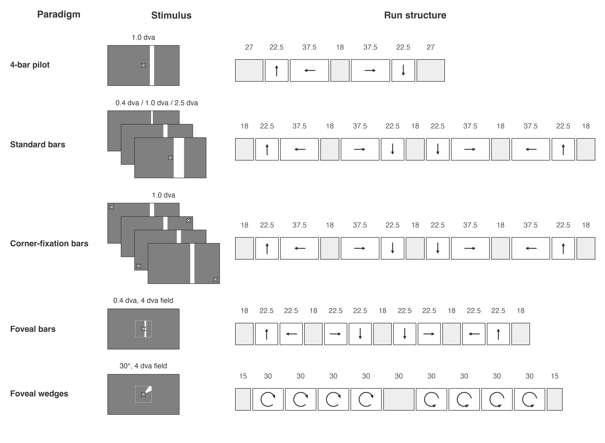

===================
Experimental Design
===================

The LAION-fMRI dataset uses a dense-sampling design: a small number of
participants are scanned across many sessions, each seeing on the order of
6,000 unique natural images. The general logic follows dense sampling designs (few
subjects, many sessions, controlled image repetitions for noise ceiling
estimation), but with a broader image set based on LAION-natural (derived from
LAION-2B, Roth & Hebart, 2025) that goes beyond standard scene or object
datasets. Each of the 5 participants completed 30 main sessions of image
viewing, one eyetracking session (ses-31), and 3 supplemental fMRI sessions
after a time gap of about half a year. The launch release focuses on the 30
main image-viewing sessions per participant; the supplemental sessions and
their additional shared images will be released later. Counting all acquired
fMRI sessions gives 165 sessions (33 per participant), plus 5 eyetracking
sessions. In total, the recording took place over the course of about 1.5
years (Nov 2024 to Mar 2026) at the Max Planck Institute for Human Cognitive
and Brain Sciences in Leipzig, Germany.

Experiments
===========

.. list-table::
   :widths: 20 30 50
   :header-rows: 1

   * - Experiment
     - Design type
     - Purpose
   * - Main image viewing (``task-images``, ses-01 to ses-30)
     - Event-related, single trials
     - Single-trial responses to ~6,100 natural images per subject
   * - Precision mapping (six sessions)
     - Sweeping bars and rotating wedges; block-design localizers
     - Population receptive-field estimates across the central and peripheral
       visual field, plus category- and motion-selective maps
   * - Eyetracking session (ses-31)
     - Mixed (calibration + image viewing + localizer + deepmreye)
     - Independent test set with concurrent eyetracking that includes
       ``task-deepmreye`` (2 runs), ``task-images`` (2 runs),
       ``task-oloc`` (4 runs)

.. todo::

   Do controversial stimuli need their own row in the table?

.. todo::

   Localizer: should it be listed as a separate experiment, or only as a
   sub-task of ses-31?

.. todo::

   Add diffusion tasks to the table?

Main Experiment
===============

In the main experiment (ses-01 to ses-30), participants viewed natural images
while performing a continuous recognition task ("Have you seen this image
before?"). On each trial participants pressed a button to indicate whether the
image was new (first presentation) or old (already seen in a previous trial or
session) with their right index finger. The task keeps participants attentive
during long sessions and yields behavioural data on memory performance; the
primary purpose of the experiment is to obtain reliable single-trial BOLD
responses to each image.

Each subject saw around 6,204 unique images across roughly 31,856 image
presentations, plus around 2,583 blank trials. The image set is split into
shared and subject-unique images. The 1,492 shared images are common to all
subjects: 881 of them are shown 12 times (the 12-repeat set, used for noise
ceiling estimation) and 611 are shown 4 times (the 4-repeat set). The
remaining 4,712 unique images per subject are shown 4 times each and are
different across subjects, which widens the total stimulus set seen across
all participants without reducing per-subject repetition counts.

Images were distributed across the 30 sessions following two scheduling rules.
First, every image was shown at least twice within the same session at some
point during the experiment, so that GLMsingle has within-session repeats to
work with for HRF fitting and ridge regression tuning. No image was shown
more than 3 times in the same session. Second, one repeat of the same image
was always kept within ±7 sessions of its twice-per-session occurrence, so
that the inter-repetition gap stays manageable for the memory task.

For details on the image content and where the images come from, see
:doc:`stimulus_data`. For information on which images are reserved for
testing, see :doc:`train_test_splits`.

Note on incomplete repetitions
------------------------------

Most images were shown for their full number of repetitions but 8 images per
participant ended up with one repetition fewer than planned. In most cases
this affects subject-unique images that were only shown 3 times and more
rarely, 12-repeat images that were only shown 11 times. The exact counts per
subject are:

.. list-table::
   :widths: 20 25 25 30
   :header-rows: 1

   * - Subject
     - unique (4 → 3 reps)
     - shared_4rep (4 → 3 reps)
     - shared_12rep (12 → 11 reps)
   * - sub-01
     - 5
     - 0
     - 3
   * - sub-03
     - 4
     - 1
     - 3
   * - sub-05
     - 5
     - 0
     - 3
   * - sub-06
     - 4
     - 0
     - 4
   * - sub-07
     - 6
     - 0
     - 2

For analyses that require an exact repetition count (across-session
``Noiseceiling4rep`` and ``Noiseceiling12rep`` maps), these images were
excluded. For analyses that average over all available repeats
(``NoiseceilingAllrep``), they remained. For cross-subject analyses, these
images should be excluded.

Session Structure
-----------------

A session always consists of 12 functional runs, plus 1 structural and 4
fieldmap acquisitions. The standard layout used for all participants from
ses-08 onwards was::

    [S F RRRR F RRRR F RRRR F]

where ``S`` = structural (MEGRE), ``F`` = fieldmap, ``R`` = experimental run.
The structural is acquired at the start of each session, followed by a
fieldmap and then groups of 4 runs separated by additional fieldmaps.
Fieldmaps are repeated multiple times throughout the session to track B0
field drift over time.

Earlier sessions (ses-01 to ses-04) used a different layout in which the
structural was placed in the middle of the session
(``[F RRRR F RR S RR F RRRR F]``). From ses-05 onward, the structural was
moved back to the start of the session.

.. todo::

   Add total session duration in minutes.

.. figure:: _static/cropped_outlinesession.png
   :align: center
   :width: 100%
   :alt: Session structure overview

   Session structure overview.

Run Parameters
--------------

.. list-table::
   :widths: 30 70
   :stub-columns: 1

   * - Duration per run
     - ~5 min (304 s for sessions 1-5, 309 s for sessions 6-34)
   * - Trials per run
     - ~94-97 (87-89 image trials + 7-8 blank trials)
   * - Runs per session
     - 12
   * - Total runs (per subject)
     - 360 (12 runs × 30 main sessions)

The acquisition TR is 1.9 s, but during preprocessing the data is temporally
upsampled to a TR of 1.0 s for GLMsingle. So depending on whether you look at
the raw or preprocessed data, the number of timepoints per run will differ
(160 or 163 raw volumes vs 304 or 310 timepoints after upsampling).

.. note::

   For MRI acquisition parameters (TR, voxel size, etc.), see
   :doc:`mri_acquisition`.

Trial Structure
---------------

Each trial lasts 3 seconds. On image trials, the stimulus is shown for 2.5 s
followed by a 0.5 s inter-stimulus interval. Blank trials have the same
duration but no image is shown. Blank trials are distributed pseudo-randomly
throughout each run and serve as a baseline condition. They also help the
BOLD signal return closer to baseline between image trials which improves
single-trial response estimation. A fixation cross in form of a small red
dot was continuously shown also during ISI and blank trials. Participants'
responses during ISI were still counted as belonging to the previous trial
image. Top button pressing indicated a new image and second button just
below indicated an old image.

.. figure:: _static/mock_session_thingsplus_ood.gif
   :align: center
   :width: 90%
   :alt: Animated example of trial sequence with image and blank trials

   Example trial sequence from the main experiment, showing image trials
   (2.5 s stimulus + 0.5 s ISI) interleaved with blank trials. The red
   fixation dot remains on screen throughout, including during the ISI and
   blank trials.

Stimulus Presentation
---------------------

Stimuli were presented through a PROpixx MRI/MEG DLP LED projector (VPixx
Technologies), mirroring a BenQ display at 1920 × 1080 px and 60 Hz refresh
rate onto a rear projection screen inside the scanner room. Each stimulus
image was rendered at 1000 × 1000 pixels, which corresponds to about
26.5 × 26.5 cm on the projection screen, or roughly 9.2 × 9.2 degrees of
visual angle. The total viewing distance was 164.8-165.7 cm (3.9-4.6 cm
from mirror to eye, plus 161 cm from mirror to screen).

The PsychoPy window used the default ``color=(0, 0, 0)`` in PsychoPy's
``rgb`` colour space. This is middle grey (0.5 per channel in normalized
RGB), not black. It filled the display outside the stimulus as well as
the inter-stimulus and blank-trial background. For the 131 RGBA PNGs in
the OOD set, transparent and partially transparent pixels were
alpha-composited over this same background during presentation.

.. list-table::
   :widths: 30 70
   :stub-columns: 1

   * - Software
     - PsychoPy
   * - Display
     - PROpixx projector + BenQ mirrored display
   * - Resolution
     - 1920 × 1080 (projector); 1000 × 1000 (stimulus)
   * - Refresh rate
     - 60 Hz
   * - Background
     - PsychoPy ``rgb=(0, 0, 0)`` (middle grey)
   * - Viewing distance
     - 164.8-165.7 cm
   * - Visual angle (stimulus)
     - ~9.2 × 9.2 degrees
   * - Scanner synchronization
     - To be documented in an upcoming update
   * - Dummy scans
     - 0

.. todo::

   Document scanner synchronization (e.g. TTL trigger, volume logging).

Behavioral Data
---------------

Behavioral data from the main experiment consists of the button
responses given during the recognition task, including the response
(old or new) and the reaction time per trial.

.. only:: live

   *Behavioral file names and column definitions will be added in an
   upcoming documentation update.*

.. only:: dev

   .. todo::

      Document the actual behavioural file shipped with the release
      (file name, location, column set, example rows). The previous
      ``events.tsv`` table here did not match what is on the bucket;
      the GLMsingle derivatives currently ship
      ``..._desc-SingletrialBetas_trials.tsv`` with
      ``session``, ``run``, ``beta_index``, ``label`` only - confirm
      whether a richer raw-BIDS ``events.tsv`` is also part of the
      release.

   .. todo::

      Specify questionnaire data (not shipped with release though).

   .. todo::

      Include summary statistics here? (mean accuracy, etc.)

   .. todo::

      Cross-reference more file locations.

Precision Mapping Experiment
============================

Retinotopic mapping and the category and motion localizers were acquired in a separate study, before the main
image-viewing experiment began, and are referred to here as the precision
mapping experiment. It comprises six sessions at TR 1.5 s: an initial
session, ``ses-4BarScreenfLoc``, which combined two retinotopy pilot runs
with the eight fLoc runs, followed by five mapping sessions holding the remaining
retinotopy runs, as well as motion localizer, resting-state, and DeepMREye acquisitions.

.. list-table::
   :widths: 28 72
   :header-rows: 1

   * - Session
     - Run sequence
   * - ``ses-4BarScreenfLoc``
     - 4bar ×2, fLoc ×8
   * - ``ses-MotionLocBarsSML``
     - (MotionLeft MotionRight) ×2, (BARS BARM BARL) ×2
   * - ``ses-BarsLMSEyeCalib``
     - RS, (BARL BARM BARS) ×2, RS, DeepMREye ×2
   * - ``ses-Corners1``
     - RS, (UpperLeft LowerLeft UpperRight LowerRight) ×2
   * - ``ses-Corners2``
     - RS, (LowerRight UpperRight LowerLeft UpperLeft) ×2
   * - ``ses-Foveal``
     - RS, (BAR WEDGE) ×4, RS

Each row lists the runs in acquisition order by their BIDS ``task-`` label.

Retinotopy
----------

To map the visual field at high resolution across a wide range of
eccentricities, three paradigms were combined. The standard paradigm swept
a bar across the full display, 17.4 x 9.8 degrees, with central fixation,
in three tasks with bar widths of 2.5, 1.0 and 0.4 degrees (``BARL``,
``BARM``, ``BARS``). The corners paradigm used the same display and the
1.0 degree bar but placed the fixation mark in one of the four corners of
the screen, 1 degree from each of the two adjacent edges, so that the
stimulus extended to 16.4 degrees horizontally and 8.8 degrees vertically
from fixation into the opposite hemifield; each corner is its own task (``UpperLeft``,
``UpperRight``, ``LowerLeft``, ``LowerRight``). The foveal paradigm
restricted the stimulus to a central 4 x 4 degree window and mapped it
with a 0.4 degree bar (``BAR``) and a 30 degree wedge rotating about
fixation (``WEDGE``). Every task was acquired four times per participant,
giving 36 mapping runs. Two shorter pilot runs with a single bar pass per
direction (``4bar``) were acquired at the start of the screening session
and are held out from the released fits. Gaze position was recorded during the foveal runs only.

   Retinotopic mapping paradigms. *Left*, a representative stimulus frame per
   paradigm, with bar width (or wedge angle) and, for the foveal paradigms,
   the extent of the stimulated field; the fixation target is enlarged for
   legibility. *Right*, run structure, with block durations in seconds.
   Straight arrows
   give the direction of bar motion, curved arrows the direction of wedge
   rotation, and shaded blocks represent blank periods.

The standard, corner and foveal bar runs share one structure: an 18 s
fixation period, four blocks of two orthogonal bar sweeps followed by an 18 s
blank, and an 18 s fixation period to close. Sweep directions follow a
palindromic sequence, so each cardinal
direction occurs twice per run and the second half of the run reverses the
first. Horizontal sweeps last 37.5 s and vertical sweeps 22.5 s on the full
display, matching bar speed across the two screen dimensions. Both last
22.5 s inside the square foveal window. Standard and corner runs therefore
last 330 s and foveal bar runs 270 s. Wedge runs last 300 s: after 15 s of
fixation the wedge completes four 30 s clockwise rotations, pauses for a 30 s
blank, completes four counter-clockwise rotations, and the run closes with
15 s of fixation. The pilot runs are shorter, at 192 s: a single sweep in
each cardinal direction, the two pairs of sweeps separated by an 18 s blank,
and 9 s of fixation followed by an 18 s blank at either end.

Background images
~~~~~~~~~~~~~~~~~

Instead of the flickering checkerboard used in classical retinotopy
(Dumoulin & Wandell, 2008), the bar and wedge apertures revealed
colourful cartoon images (Finzi et al., 2021), aiming to drive higher-level
visual areas more effectively. A new image was drawn every 0.1 s, in random
order from a bank of 63. The full-display runs stretched a 1244 x 700 px
image across the whole screen. The foveal runs used the same images, scaled
and cropped to 440 x 440 px to fit inside the 4 degree window.

Task
~~~~

Participants were instructed to hold fixation throughout all runs and to press
any button whenever the fixation mark changed. The mark is a small dark
diagonal cross, 0.07 degrees (8 px) across, drawn over a larger, thin, low-contrast diagonal cross that
serves as a fixation guide. In the standard bar runs the arms of the guide
cross the entire display. In the corner runs they extend only 1 degree from
fixation, so that the cross keeps four arms of equal length instead of being
cut off by the nearby screen edges. In the foveal runs they extend 2 degrees,
spanning the foveal window from corner to corner. At each target the small
cross switches from dark to light against the mid-grey background for 300 ms
and then back.

.. only:: dev

   .. todo::

      State the size of the main-experiment fixation dot in degrees; it is
      not specified anywhere on this page.

Target times were drawn independently per run, at a mean interval of 3.2 s
jittered uniformly by ±0.9 s in the standard and corner runs and by ±0.5 s
in the foveal and ``task-4bar`` runs, clipped to the range 2.5-4.5 s. Targets
run from the end of the opening fixation period to the end of the run, so
they occur during blank periods as well as during sweeps. Because the task
is at fixation and is orthogonal to bar position, it holds attention and
gaze without contributing a stimulus-locked component to the pRF fits.

The fitted pRF models, the recommended surface map, parameter
definitions and quality-control caveats will be documented in an upcoming
documentation update.

.. only:: dev

   .. todo::

      Add citation to the retinotopy paper once it's available
      (Satzger et al., in prep).

Localizers
----------

Three functional localizers were acquired: a category localizer (fLoc) and a
motion localizer within the precision mapping sessions, and an object
localizer (``task-oloc``) in the eyetracking session (``ses-31``) of the main
experiment, described here with the other two for convenience. All three are
block designs with a fixation task and were run from precomputed,
participant-independent trial sequences, so every participant saw identical
stimulation. The eyetracking session was acquired at TR 1.9 s rather than
1.5 s; the preprocessed timeseries the localizer GLMs use are upsampled to
TR 1 s in either case (:doc:`preprocessing`).

Category localizer (fLoc)
~~~~~~~~~~~~~~~~~~~~~~~~~

The category localizer (``task-floc``, ``ses-4BarScreenfLoc``) is the
Stanford fLoc paradigm (Stigliani et al., 2015; stimuli and code at
https://github.com/VPNL/fLoc), run in its two-stimulus-set mode. Each run
shows five categories, each drawn from one of two subcategories of the fLoc
image database:

.. list-table::
   :widths: 24 38 38
   :header-rows: 1

   * - Category
     - Stimulus set 1 (odd runs)
     - Stimulus set 2 (even runs)
   * - face
     - adult faces
     - child faces
   * - body
     - headless bodies
     - limbs
   * - place
     - houses
     - corridors
   * - object
     - cars
     - string instruments
   * - character
     - pseudowords
     - numbers

Odd-numbered runs show stimulus set 1 and even-numbered runs stimulus set 2.
The image sequence of every run is fixed and identical across participants:
four sequences were generated in advance, runs 1-4 present sequences 1-4, and
runs 5-8 present the same four sequences again, image for image, in the same
order and with the same task probes. The four sequences use disjoint images,
so each image appears in exactly one sequence and is seen twice per
participant (once in runs 1-4, once in runs 5-8).

**Block design.** Images are shown for 400 ms followed by a 100 ms blank, 12
images per 6 s block. Each run has 6 blocks per category and 8 baseline blocks
(fixation only), 38 blocks in total, in a pseudo-random order in which
same-category blocks are occasionally adjacent. With a 9 s fixation period at
the start and the end, a run lasts 246 s (164 volumes at the acquired TR of
1.5 s; 246 timepoints after upsampling to 1 s).

**Task.** One-back repetition detection with 18 repeats per run. A red
fixation dot of 0.07 degrees diameter, the same extent as the retinotopy
cross, is shown throughout.

Object localizer
~~~~~~~~~~~~~~~~

The object localizer (``task-oloc``, ``ses-31``) contrasts intact object images with
scrambled versions of the same images, following Malach et al. (1995). The
stimuli are 43 colour photographs
of isolated everyday objects (a trophy, a vase, a locomotive, ...) rendered on
a grey grid background, and for each object a grid-scrambled counterpart
in which the image tiles are shuffled over the same grid, so that intact and
scrambled images share low-level content, colour and extent.

**Block design.** Images are presented at 750 px, about 6.8 degrees, and are
shown for 400 ms followed by a 100 ms blank, 12 images per 6 s block. Each
run has 8 object blocks, 8 scrambled blocks and 6
baseline blocks (fixation only), 22 blocks in total, in a pseudo-random order
in which same-condition blocks are occasionally adjacent. With 9 s of
fixation at the start and the end the design covers 150 s; 80 volumes were
acquired at the TR of 1.9 s, i.e. 152 s, giving 152 timepoints after
upsampling to 1 s. Every run draws
on all 86 images, each shown about twice per run.

**Task.** One-back repetition detection with 20 repeats per run.

**Run structure.** Two fixed sequences exist. Runs 1 and 3 present sequence 1
and runs 2 and 4 present sequence 2, image for image and with the same
probes, identically for all participants.

Motion localizer
~~~~~~~~~~~~~~~~

The motion localizer (``task-MotionLeft`` and ``task-MotionRight``,
``ses-MotionLocBarsSML``) is a
random-dot kinematogram contrasting moving with static dots, presented to one
visual hemifield at a time so that MT and MST can be separated by their
different sensitivity to ipsilateral motion (Huk et al., 2002). In a
``MotionLeft`` run the fixation dot sits
7.7° right of the screen centre and the dot field is centred 4.2° left of it,
i.e. 11.9° into the left hemifield; a ``MotionRight`` run mirrors this
geometry. The dot field is a disc of 3.5° radius containing 200 grey dots of
0.2°, with a 0.5° dot-free zone around its centre. The stimulus therefore
covers 8.4-15.4° of eccentricity along the horizontal meridian.

**Block design.** Each run alternates 10 moving and 10 static blocks of 12 s.
During a moving block the dots move radially at 8°/s, alternating between
expansion and contraction every 1 s, with a limited dot lifetime of 10
frames; during a static block the same dot field is shown stationary. With
9 s of fixation at the start and the end a run lasts 258 s (172 volumes at
the acquired TR of 1.5 s; 258 timepoints after upsampling to 1 s).

**Task.** Fixation-colour-change detection: the fixation dot, 0.1 degrees
in diameter inside a 0.2 degree surround, changes colour for 300 ms at random intervals of 4-9 s and participants press a button
within 1.5 s.

**Run structure.** Block timing is fixed by the settings and identical across
runs, hemifields and participants. Only the fixation-change times are
random. Each participant has two runs per hemifield, four in total.

Behavioural data
----------------

In every retinotopy, category-localizer and motion-localizer run the
presentation software logged the onset of each target or one-back probe
together with the button presses and their reaction times, so hit rate and
response latency can be derived per run. The object localizer was presented
with the main experiment's software in the eyetracking session; its
behavioural records are covered by the Behavioral Data section of the main
experiment above.

.. only:: dev

   .. todo::

      Confirm from the main-experiment presentation code that one-back
      responses and reaction times were logged for the ``task-oloc`` runs
      (no oLoc session code is in the DenseRetinotopy repository), and state
      whether the precision-mapping logs ship with the release and, if so,
      document file names, location and columns.

References
==========

- Dumoulin SO and Wandell BA (2008) Population receptive field estimates in
  human visual cortex. *NeuroImage* 39:647-660.
  `doi:10.1016/j.neuroimage.2007.09.034
  <https://doi.org/10.1016/j.neuroimage.2007.09.034>`_
- Finzi D, Gomez J, Nordt M, Rezai AA, Poltoratski S and Grill-Spector K
  (2021) Differential spatial computations in ventral and lateral
  face-selective regions are scaffolded by structural connections.
  *Nature Communications* 12:2278.
  `doi:10.1038/s41467-021-22524-2
  <https://doi.org/10.1038/s41467-021-22524-2>`_
- Huk AC, Dougherty RF and Heeger DJ (2002) Retinotopy and functional
  subdivision of human areas MT and MST. *Journal of Neuroscience*
  22:7195-7205.
  `doi:10.1523/JNEUROSCI.22-16-07195.2002
  <https://doi.org/10.1523/JNEUROSCI.22-16-07195.2002>`_
- Malach R, Reppas JB, Benson RR, Kwong KK, Jiang H, Kennedy WA, Ledden PJ,
  Brady TJ, Rosen BR and Tootell RBH (1995) Object-related activity revealed
  by functional magnetic resonance imaging in human occipital cortex.
  *PNAS* 92:8135-8139.
  `doi:10.1073/pnas.92.18.8135 <https://doi.org/10.1073/pnas.92.18.8135>`_
- Stigliani A, Weiner KS and Grill-Spector K (2015) Temporal processing
  capacity in high-level visual cortex is domain specific.
  *Journal of Neuroscience* 35:12412-12424.
  `doi:10.1523/JNEUROSCI.4822-14.2015
  <https://doi.org/10.1523/JNEUROSCI.4822-14.2015>`_
