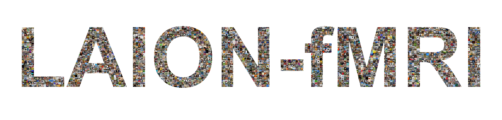

.. warning::

   **Draft documentation.** This documentation is a work in progress and is not
   yet complete. Sections may be incomplete, inaccurate, or subject to change
   before the dataset's official release. Please treat all content as
   provisional.

**LAION-fMRI** is a deeply-sampled 7T fMRI dataset of brain responses to visual
images, built to uncover how the human brain sees and understands the world.
Five participants viewed over 25,000 unique natural images across 165 sessions,
capturing hundreds of thousands of brain responses at 1.8 mm resolution with an
ultra-high-field 7T MRI scanner.

The images span everything from everyday photographs - drawn from a 120M
image-text corpus (Roth & Hebart, 2025) - to abstract shapes and visual
illusions, ensuring the dataset covers the full breadth of human visual
experience. Every image was measured multiple times, delivering exceptional
signal quality and setting new standards for the field.

Beyond functional brain scans, the dataset includes rich complementary data:
retinotopic mapping, functional localizers, precision diffusion MRI, and
behavioral responses - making it one of the most deeply characterized
neuroimaging resources assembled to date.

* **Scale** - thousands of unique images per participant (including ~2,200 shared
  across subjects), 34 sessions each, up to 12 repeats for shared images
* **Acquisition** - multi-echo 7T fMRI at 1.8 mm isotropic, 1.9 s TR
* **Broad sampling** - natural photographs, prior benchmark images (NSD,
  THINGS), plus out-of-distribution test stimuli
* **Single-trial betas** - GLMsingle-derived response estimates with strong
  noise ceilings
* **Complementary data** - retinotopy, functional localizers, diffusion MRI,
  behavioral responses
* **Open** - freely available for research

Getting Started
===============

.. grid:: 1 2 2 2
    :gutter: 2

    .. grid-item-card:: Quickstart
        :link: quickstart
        :link-type: doc
        :class-card: sd-border-0
        :shadow: sm

        Get started quickly with basic examples

        +++
        Load and explore the data in minutes

    .. grid-item-card:: Dataset at a Glance
        :link: dataset_at_a_glance
        :link-type: doc
        :class-card: sd-border-0
        :shadow: sm

        Overview of all data, spaces, and ROIs

        +++
        What's in the dataset and what you need

    .. grid-item-card:: Data Access
        :link: data_access
        :link-type: doc
        :class-card: sd-border-0
        :shadow: sm

        Download and access instructions

        +++
        AWS S3, Python package, and more

    .. grid-item-card:: Brain Viewer
        :link: https://laion-fmri.hebartlab.com/brain/
        :class-card: sd-border-0
        :shadow: sm

        Interactive 3D voxel explorer

        +++
        Browse responses and concept maps in-browser

.. toctree::
   :maxdepth: 2
   :hidden:
   :caption: Getting Started

   Home <self>
   quickstart
   dataset_at_a_glance
   data_access

.. toctree::
   :maxdepth: 2
   :hidden:
   :caption: Python Package

   laion_fmri_package/index
   auto_examples/index

.. toctree::
   :maxdepth: 2
   :hidden:
   :caption: Core Data

   anatomical_data
   fmri_data
   diffusion
   rois
   retinotopy
   localizers
   glmsingle_betas

.. toctree::
   :maxdepth: 2
   :hidden:
   :caption: Stimuli & Splits

   stimulus_data
   train_test_splits

.. toctree::
   :maxdepth: 2
   :hidden:
   :caption: Methods

   experimental_design
   mri_acquisition
   preprocessing
   quality_control
   stimulus_selection
   metadata_acquisition

.. toctree::
   :maxdepth: 2
   :hidden:
   :caption: Reference

   faq
   technical_notes
   example_methods_text
   contributing
   release-history

Latest Updates
==============

.. todo::

   Keep this short — 3-5 most recent updates, one line each. Move older
   entries to :doc:`release-history` when the list gets long.

* **YYYY-MM-DD** — (placeholder)
