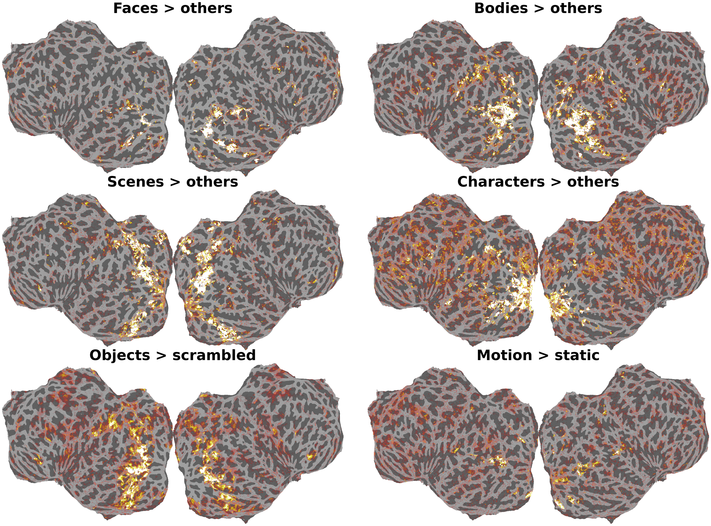

======================
Functional Localizers
======================

Three independent localizers were run to identify category-selective
(Stigliani et al., 2015), object-selective (Malach et al., 1995) and
motion-selective (Huk et al., 2002) regions. Each was analysed with the same
GLM pipeline, producing per-condition and per-contrast maps in
``fsnative`` and in the participant's ``T1w`` volume. The unthresholded
contrast maps are the basis for the manually delineated ROIs documented in
:doc:`rois`. For details on the stimuli and run sequences see
:doc:`experimental_design`.

.. _localizer-glm:

GLM Analysis
============
  
All three localizers were analysed with the same general linear model,
implemented with ``nilearn.glm.first_level`` (Abraham et al., 2014). For the
surface maps, the preprocessed timeseries were first projected to each
participant's ``fsnative`` surface with FreeSurfer ``mri_vol2surf`` and the
model was fitted per vertex. The volumetric maps come from the same model
fitted to the voxel data.

Each condition enters the design as a block regressor rather than as
individual trials. In fLoc, consecutive trials of the same category form one
block. Regressors were convolved with the SPM haemodynamic response
function without temporal or dispersion derivatives. Low-frequency drift is
handled inside the model by a cosine basis set equivalent to a 1/128 Hz
high-pass filter. The input timeseries is in percent signal change.

The model was fitted per run with an AR(1) noise model. Contrast estimates
and their variances were then combined across the runs of a localizer by
inverse-variance-weighted fixed effects. The released z-maps are the result
of this combination, and the per-run condition estimates are released
alongside them as effect-size maps.

Localizer-specific details
--------------------------

**Category localizer.** The eight runs alternate between the two fLoc
stimulus sets. Odd runs show set 1 (adult faces, headless bodies, houses,
cars, pseudowords) and even runs set 2 (child faces, limbs, corridors, string
instruments, numbers). Runs 5-8 replay the image sequences of runs 1-4.
The released contrasts pool all eight runs estimating each
category's response averaged over its two subcategories. The per-run
effect-size maps keep the subcategories apart by run parity so users may create
alternative contrasts.

**Motion localizer.** Two of the four runs restrict the stimulus to the left visual field and two to
the right, and the per-hemifield moving-versus-static maps can be read
hemisphere-wise as ipsi- and contralateral responses. Responses to
ipsilateral motion help distinguish MST from the predominantly contralateral
responses in MT.

.. _localizer-contrasts:

Released Contrasts
==================

   Main localizer contrasts for sub-03, on the flattened left and right
   hemispheres. The five fLoc contrasts are each category against the mean
   of the other four. The object localizer is objects against their
   grid-scrambled counterparts, and the motion localizer is moving against
   static dots, pooled over both hemifields. Maps are the released
   z-statistics, combined across runs by fixed effects, shown unthresholded.
   The same maps with the manually delineated ROIs overlaid are shown in
   :doc:`rois`.

All contrasts are released as unthresholded z-maps, combined across the runs
of a localizer as described above. For the category localizer, the main
contrast for each of the five categories (faces, bodies, places, objects,
characters) is that category against the mean of the other four. Each
category is also contrasted against the fixation baseline, and four pairwise
contrasts are included: faces, bodies and places each against objects, and
characters against faces. The object localizer contrasts intact objects
against their grid-scrambled counterparts, and each condition against
baseline. The motion localizer contrasts moving against static dots, and each
against baseline. These motion contrasts are available pooled over all four
runs and separately for stimulation of the left and the right visual
hemifield. Alongside the contrasts, the per-run condition estimates are
released as effect-size maps, one per condition and run.

.. list-table::
   :widths: 16 26 8 50
   :header-rows: 1

   * - Localizer
     - Session
     - Runs
     - Contrasts
   * - Category (fLoc)
     - ses-4BarScreenfLoc
     - 8
     - - {category}VsOthers
       - {category}VsBaseline
       - faceVsObject, bodyVsObject, placeVsObject, characterVsFace
   * - Object
     - ses-31
     - 4
     - - objectVsScrambled
       - objectVsBaseline, scrambledVsBaseline
   * - Motion
     - ses-MotionLocBarsSML
     - 4
     - - movingVsStatic
       - movingVsBaseline, staticVsBaseline
       - each for task-MotionLoc, task-MotionLeft, task-MotionRight

Run counts are per participant. Sub-01 is missing the final fLoc run.

Spaces
======

.. list-table::
   :widths: 30 70
   :header-rows: 1

   * - Sampling
     - Notes
   * - ``space-fsnative``
     - Per-hemisphere surface maps (``hemi-L`` / ``hemi-R``). The canonical
       form: the GLM is fitted here, and the ROIs are drawn on it.
   * - ``space-T1w res-1pt5``
     - Volumetric, from a GLM fitted on voxels covering cortical ribbon and
       subcortical and cerebellar regions, provided as one NIfTI per map.
       Canonical for the volume: this is the grid the GLM was fitted on.
   * - ``space-T1w res-1pt8``
     - The res-1pt5 volumetric maps resampled trilinearly onto the GLMsingle beta grid
       (143³, 1.778 mm), so localizer contrasts and single-trial betas
       share voxel indices. A resampled **view** of the 1.5 mm product, not
       a refit.

.. warning::

   Interpolation is confined to the fitted volume: an output voxel is
   written only where at least half its interpolation weight comes from
   voxels the GLM estimated, and is NaN otherwise. So unestimated voxels
   neither dilute their neighbours nor inflate the coverage.

Downloading and loading
=======================

A subject's localizer derivatives, a few hundred MB, are pulled in full
with the ``include_localizers`` flag:

.. code-block:: python

   from laion_fmri.download import download

   download(subject="sub-03", include_localizers=True)

The derivative path helper handles the session and surface/volume naming:

.. code-block:: python

   import nibabel as nib
   from laion_fmri.derivatives import localizer_statmap_path

   path = localizer_statmap_path(
       "sub-03", task="floc", contrast="faceVsOthers",
       session="4BarScreenfLoc", space="fsnative", hemi="L",
   )
   z = nib.load(path).agg_data()

For the object localizer pass ``task="oloc", session="31"``. For a
volumetric map pass ``space="T1w"`` with ``res="1pt5"`` or ``res="1pt8"`` and
omit ``hemi``.

The per-run condition estimates have their own helper. It takes the
regressor name and the run, and returns the path to that run's effect-size
map in percent signal change; ``space``, ``hemi`` and ``res`` work as above:

.. code-block:: python

   from laion_fmri.derivatives import localizer_effect_path

   path = localizer_effect_path(
       "sub-03", task="floc", condition="face",
       session="4BarScreenfLoc", run=1, hemi="L",
   )

Pass ``task="MotionLeft"`` or ``"MotionRight"``; the pooled ``MotionLoc`` map
has no runs of its own.

File organization
=================

Localizer maps are per-session, so they sit under ``sub-XX/ses-YY/func/``.
``contrast-`` names the contrast in camelCase, ``stat-`` the statistic
(``z`` for contrasts, ``effect`` for per-run condition estimates).

.. code-block:: text

    derivatives/localizers/
    └── sub-XX/
        ├── ses-4BarScreenfLoc/
        │   └── func/
        │       ├── sub-XX_ses-4BarScreenfLoc_task-floc_hemi-L_space-fsnative_contrast-faceVsOthers_stat-z_statmap.func.gii
        │       ├── sub-XX_ses-4BarScreenfLoc_task-floc_run-01_hemi-L_space-fsnative_contrast-body_stat-effect_statmap.func.gii
        │       ├── sub-XX_ses-4BarScreenfLoc_task-floc_space-T1w_res-1pt5_contrast-faceVsOthers_stat-z_statmap.nii.gz
        │       ├── sub-XX_ses-4BarScreenfLoc_task-floc_run-01_space-T1w_res-1pt5_contrast-body_stat-effect_statmap.nii.gz
        │       └── sub-XX_ses-4BarScreenfLoc_task-floc_space-T1w_res-1pt8_contrast-faceVsOthers_stat-z_statmap.nii.gz
        ├── ses-MotionLocBarsSML/
        │   └── func/
        │       ├── sub-XX_ses-MotionLocBarsSML_task-MotionLoc_hemi-L_space-fsnative_contrast-movingVsStatic_stat-z_statmap.func.gii
        │       └── sub-XX_ses-MotionLocBarsSML_task-MotionLeft_hemi-L_space-fsnative_contrast-movingVsStatic_stat-z_statmap.func.gii
        └── ses-31/
            └── func/
                └── sub-XX_ses-31_task-oloc_hemi-L_space-fsnative_contrast-objectVsScrambled_stat-z_statmap.func.gii

References
==========

- Abraham A, Pedregosa F, Eickenberg M, Gervais P, Mueller A, Kossaifi J,
  Gramfort A, Thirion B and Varoquaux G (2014) Machine learning for
  neuroimaging with scikit-learn. *Frontiers in Neuroinformatics* 8:14.
  `doi:10.3389/fninf.2014.00014 <https://doi.org/10.3389/fninf.2014.00014>`_
- Huk AC, Dougherty RF and Heeger DJ (2002) Retinotopy and functional
  subdivision of human areas MT and MST. *Journal of Neuroscience*
  22:7195-7205.
  `doi:10.1523/JNEUROSCI.22-16-07195.2002
  <https://doi.org/10.1523/JNEUROSCI.22-16-07195.2002>`_
- Malach R, Reppas JB, Benson RR, Kwong KK, Jiang H, Kennedy WA, Ledden PJ,
  Brady TJ, Rosen BR and Tootell RBH (1995) Object-related activity revealed
  by functional magnetic resonance imaging in human occipital cortex.
  *PNAS* 92:8135-8139.
  `doi:10.1073/pnas.92.18.8135 <https://doi.org/10.1073/pnas.92.18.8135>`_
- Stigliani A, Weiner KS and Grill-Spector K (2015) Temporal processing
  capacity in high-level visual cortex is domain specific.
  *Journal of Neuroscience* 35:12412-12424.
  `doi:10.1523/JNEUROSCI.4822-14.2015
  <https://doi.org/10.1523/JNEUROSCI.4822-14.2015>`_
