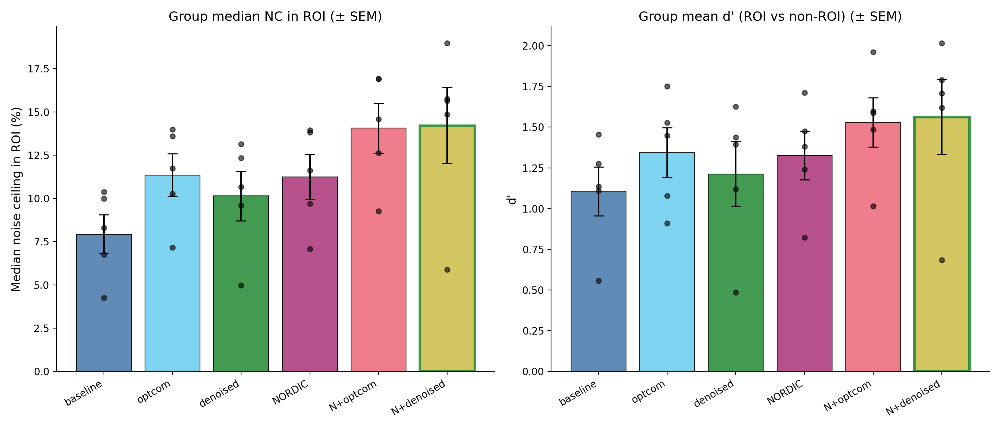

==============
Preprocessing
==============

.. todo::

   Introductory narrative (2-3 sentences): Which pipeline was used and why?
   Emphasize that both raw and preprocessed data are provided so users can
   rerun their own pipeline if desired. Link to the dataset paper.

For raw data acquisition parameters, see :doc:`mri_acquisition`.

Preprocessing Steps
===================

.. todo::

   List the actual preprocessing steps applied, separately for anatomical
   and functional data. Note any non-default settings. Add a brief narrative
   on key decisions (e.g., why a particular SDC method, whether slice timing
   correction was applied, whether smoothing was applied or not).

Comparing combinations of NORDIC and tedana
--------------------------------

To decide on which preprocessing variant to use, we ran a small variant comparison on the
first session only. The goal was to assess how much the denoising and echo-combination
choices change the reliability of the downstream single-trial betas.

The comparison used a 2 x 3 design: NORDIC denoising was either off or on, crossed with three tedana settings (no tedana, optimally-combined echoes (``optcom``), and ICA-denoised tedana output). Each variant was preprocessed from the same raw multi-echo data and then fit with GLMsingle. Noise ceilings were computed from repeated image presentations as described in :doc:`glmsingle_betas`; for this summary, they were reduced to the median noise ceiling in a fixed visually responsive ROI and to d-prime separating visually responsive from non-responsive voxels.

The visually responsive ROI was a data-driven mask, defined from leave-one-run-out visual-effect maps, using voxels whose cross-validated image-versus-blank response was positive and above the chosen threshold. The same ROI mask was then used for all six preprocessing variants, so ROI definition did not depend on the variant being evaluated.

We used two metrics because they capture complementary parts of the result. The median ROI noise ceiling is a voxelwise estimate, summarized across the visually responsive ROI, of how much variance in the single-trial betas is repeatable across presentations of the same image. It is reported as a percentage and can be read as an upper bound on the :math:`R^2` that a stimulus-based encoding model could achieve in those voxels. The median, rather than the mean, makes the summary less sensitive to a small number of very high- or low-ceiling voxels. The d-prime metric asks a different question: are visually responsive voxels separated from non-responsive voxels in their noise-ceiling values? We computed it as ``(mean_ROI - mean_nonROI) / SD_pooled`` across voxelwise noise ceilings, so higher values indicate cleaner separation between the two voxel populations.

   Preprocessing variant comparison for five subjects in ``ses-01``. The
   left panel shows the median noise ceiling in visually responsive voxels;
   the right panel shows d-prime separation between visually responsive and
   non-responsive voxels. Points show individual subjects, and bars show
   group mean +/- SEM.

The comparison included ``sub-01``, ``sub-03``, ``sub-05``, ``sub-06``, and
``sub-07``, with 12 runs per subject. NORDIC alone and tedana ``optcom``
alone gave similar improvements over the baseline preprocessing (about
42-43 % in median ROI noise ceiling). Combining NORDIC with tedana gave the
largest gains, around 77-79 % in median ROI noise ceiling and 38-41 % in
d-prime.

This result sits slightly outside the default GLMsingle advice. The
`GLMsingle documentation`_ cautions that projecting out nuisance components
before GLMsingle, including ICA-derived noise or low-rank approaches such as
NORDIC, is not generally recommended because it can introduce bias and
duplicate part of GLMsingle's own data-driven denoising. In this
dataset, NORDIC improved the noise-ceiling summaries, so we considered it
justified despite the general caution.

We did not, however, choose the most aggressive variant. NORDIC followed by
tedana ICA denoising was slightly ahead at the group level, but it reduced
the noise ceiling for ``sub-07`` relative to the NORDIC + ``optcom`` variant.
Given that subject-specific drop, and because GLMsingle already performs its
own GLMdenoise step, we treated NORDIC + tedana ``optcom`` as the more robust
choice for the beta pipeline. This keeps the gain from NORDIC while avoiding
an additional ICA-denoising step that was not consistently beneficial.

A caveat is important here: this comparison used only one session, so the
absolute noise-ceiling values are lower than they should be for the full
dataset. Only stimuli with repeated presentations can enter the estimate,
and most usable repeated stimuli in one session have only two presentations.
However, this limitation applies equally to all six variants.

.. _GLMsingle documentation: https://glmsingle.readthedocs.io/en/latest/wiki.html#pre-processing-choices

Parameters
==========

.. todo::

   Fill in all parameter values below. Add or remove rows as needed to
   match the actual pipeline configuration.

.. list-table::
   :widths: 30 70
   :stub-columns: 1

   * - Pipeline
     - (placeholder)
   * - Version
     - (placeholder)
   * - Template
     - (placeholder)
   * - Output spaces
     - (placeholder)
   * - Output resolution
     - (placeholder)
   * - Slice timing correction
     - (placeholder — applied or not?)
   * - SDC method
     - (placeholder)
   * - High-pass filter
     - (placeholder)
   * - Smoothing
     - (placeholder)

Output Files
============

See :doc:`fmri_data` for a full description of the preprocessed output files,
including confound regressors.

Quality Control
===============

For quality control details — MRIQC metrics, motion thresholds, exclusion
criteria, and known issues — see :doc:`quality_control`.
