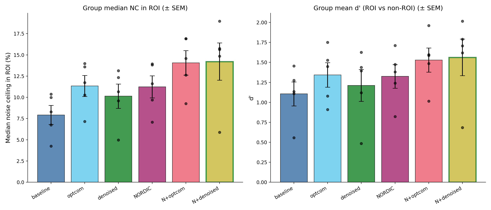

==============
Preprocessing
==============

The functional data were preprocessed with NORDIC denoising followed
by tedana optimal echo combination, and the resulting BOLD timeseries
were fed to GLMsingle. Both raw and preprocessed data are shipped, so
you can rerun your own pipeline if you prefer. The choice of pipeline
is explained below.

For raw-data acquisition parameters, see :doc:`mri_acquisition`.

Pipeline Overview
=================

The pipeline follows a lazy-resampling design: spatial corrections are
estimated as transforms on the native grid, and the BOLD data are
resampled once per volume at the final interpolation step. Spatial
parameters are estimated on the middle target echo (echo 2, TE =
28.82 ms) and then applied to echoes 1 and 3 as well, so all three
echoes enter tedana with identical geometry.

Slice timing and temporal upsampling
------------------------------------

Slice timing correction is performed with the bundled ``pyslicetime``
library, following Kendrick Kay's MATLAB ``tseriesinterp.m``
implementation. The same step upsamples the data from TR = 1.9 s to
TR = 1.0 s, giving GLMsingle a cleaner stimulus-onset grid.

Gradient distortion correction
------------------------------

Gradient nonlinearities at 7T introduce a fixed geometric warp that
depends on the gradient coil. The warp is estimated once per session
from a single SBRef using FSL's ``gradient_unwarp.py`` with the
Siemens ``.grad`` coefficient file for the Terra.X scanner and applied
to all SBRefs in the session. The BOLD data themselves are not
resampled at this stage.

Fieldmap preparation
--------------------

For each fieldmap acquisition, the two magnitude images are averaged,
brain-extracted with FSL BET (``fracintensity = 0.6``), eroded to drop
noisy edge voxels, and paired with the phase-difference image converted
to a B0 deviation map using ``delta_TE = 1.02 ms``. The gradient
distortion correction warp is applied so the fieldmap and magnitude
image share the corrected SBRef geometry.

Within a session, the four fieldmaps are co-registered to the first
fieldmap with FLIRT (``cost = normcorr``). They are then interpolated
along the session timeline with a first-order B-spline, producing one
per-run fieldmap whose effective time matches the centre of the
corresponding functional run.

Susceptibility distortion correction
------------------------------------

Susceptibility-induced EPI distortions are corrected with FSL FUGUE.
The interpolated per-run fieldmap is unmasked to avoid edge
discontinuities, then forward-warped into EPI space with FUGUE
(``s = 0.5``) to match the distorted SBRef geometry. A rigid FLIRT
registration (``dof = 6``, ``cost = normcorr``) aligns the
forward-distorted magnitude image to the SBRef, and FUGUE produces a
shift map kept as a relative warp for final interpolation.

Motion and session alignment
----------------------------

The gradient- and susceptibility-distortion warps are composed and
applied to the SBRef before motion correction. FSL MCFLIRT then
estimates a six-degree-of-freedom rigid-body transform for each volume
against this geometrically corrected SBRef.

Runs within a session are registered to the first run with FLIRT
(``dof = 12``, ``cost = normcorr``, ``interp = spline``) on a
homogenised, brain-extracted SBRef. Across sessions, each session's
run-01 SBRef is registered to the reference session's run-01 SBRef
(``ses-01``), followed by a second FLIRT re-optimisation to refine the
combined transform.

Structural alignment and final interpolation
--------------------------------------------

The functional reference is registered to the subject's T2w image with
ANTs. The T2w image is used because the 7T T2*-weighted EPI contrast
resembles T2w more closely than T1w; the T2w has already been brought
into T1w native space, so T1w defines the output coordinate frame. The
T2w is brain-extracted and resampled to the functional resolution.

For every volume, the gradient-distortion warp, susceptibility warp,
motion transform, within/across-session transforms, and structural warp
are composed into a single warp and applied to the original
slice-time-corrected volume in one spline-interpolated pass. The final
voxel size is 1.778 mm isotropic, chosen from the smallest acquired
dimension so no axis is downsampled.

Tedana optimal combination
--------------------------

The three preprocessed echoes are passed to tedana 25.1.0 using the
``t2smap`` workflow. Tedana estimates a T2* map and produces a
T2*-weighted optimal combination of the three echoes using a
log-linear monoexponential fit.

Tedana ICA denoising is not used in the final pipeline. The
downstream GLMsingle fit performs its own data-driven denoising and
fractional ridge regression, and the preprocessing comparison below
showed that stacking tedana ICA denoising on top of GLMsingle was not
consistently beneficial across subjects.

Comparing combinations of NORDIC and tedana
-------------------------------------------

To decide on which preprocessing variant to use, we ran a small variant comparison on the
first session only. The goal was to assess how much the denoising and echo-combination
choices change the reliability of the downstream single-trial betas.

The comparison used a 2 x 3 design: NORDIC denoising was either off or on, crossed with three tedana settings (no tedana, optimally-combined echoes (``optcom``), and ICA-denoised tedana output). Each variant was preprocessed from the same raw multi-echo data and then fit with GLMsingle. Noise ceilings were computed from repeated image presentations as described in :doc:`glmsingle_betas`; for this summary, they were reduced to the median noise ceiling in a fixed visually responsive ROI and to d-prime separating visually responsive from non-responsive voxels.

The visually responsive ROI was a data-driven mask, defined from leave-one-run-out visual-effect maps, using voxels whose cross-validated image-versus-blank response was positive and above the chosen threshold. The same ROI mask was then used for all six preprocessing variants, so ROI definition did not depend on the variant being evaluated.

We used two metrics because they capture complementary parts of the result. The median ROI noise ceiling is a voxelwise estimate, summarized across the visually responsive ROI, of how much variance in the single-trial betas is repeatable across presentations of the same image. It is reported as a percentage and can be read as an upper bound on the :math:`R^2` that a stimulus-based encoding model could achieve in those voxels. The median, rather than the mean, makes the summary less sensitive to a small number of very high- or low-ceiling voxels. The d-prime metric asks a different question: are visually responsive voxels separated from non-responsive voxels in their noise-ceiling values? We computed it as ``(mean_ROI - mean_nonROI) / SD_pooled`` across voxelwise noise ceilings, so higher values indicate cleaner separation between the two voxel populations.

   Preprocessing variant comparison for five subjects in ``ses-01``. The
   left panel shows the median noise ceiling in visually responsive voxels;
   the right panel shows d-prime separation between visually responsive and
   non-responsive voxels. Points show individual subjects, and bars show
   group mean +/- SEM.

The comparison included ``sub-01``, ``sub-03``, ``sub-05``, ``sub-06``, and
``sub-07``, with 12 runs per subject. NORDIC alone and tedana ``optcom``
alone gave similar improvements over the baseline preprocessing (about
42-43 % in median ROI noise ceiling). Combining NORDIC with tedana gave the
largest gains, around 77-79 % in median ROI noise ceiling and 38-41 % in
d-prime.

This result sits slightly outside the default GLMsingle advice. The
`GLMsingle documentation`_ cautions that projecting out nuisance components
before GLMsingle, including ICA-derived noise or low-rank approaches such as
NORDIC, is not generally recommended because it can introduce bias and
duplicate part of GLMsingle's own data-driven denoising. In this
dataset, NORDIC improved the noise-ceiling summaries, so we considered it
justified despite the general caution.

We did not, however, choose the most aggressive variant. NORDIC followed by
tedana ICA denoising was slightly ahead at the group level, but it reduced
the noise ceiling for ``sub-07`` relative to the NORDIC + ``optcom`` variant.
Given that subject-specific drop, and because GLMsingle already performs its
own GLMdenoise step, we picked NORDIC + tedana ``optcom`` for the beta
pipeline. This keeps the gain from NORDIC while avoiding an additional
ICA-denoising step that was not consistently beneficial across subjects.

A caveat is important here: this comparison used only one session, so the
absolute noise-ceiling values are lower than they should be for the full
dataset. Only stimuli with repeated presentations can enter the estimate,
and most usable repeated stimuli in one session have only two presentations.
However, this limitation applies equally to all six variants.

.. _GLMsingle documentation: https://glmsingle.readthedocs.io/en/latest/wiki.html#pre-processing-choices

.. only:: dev

   Parameters
   ==========

   .. todo::

      Fill in all parameter values below. Add or remove rows as needed to
      match the actual pipeline configuration.

   .. list-table::
      :widths: 30 70
      :stub-columns: 1

      * - Pipeline
        - (placeholder)
      * - Version
        - (placeholder)
      * - Template
        - (placeholder)
      * - Output spaces
        - (placeholder)
      * - Output resolution
        - (placeholder)
      * - Slice timing correction
        - (placeholder — applied or not?)
      * - SDC method
        - (placeholder)
      * - High-pass filter
        - (placeholder)
      * - Smoothing
        - (placeholder)

Output Files
============

See :doc:`fmri_data` for a full description of the preprocessed output files,
including confound regressors.

Quality Control
===============

For quality control details — MRIQC metrics, motion thresholds, exclusion
criteria, and known issues — see :doc:`quality_control`.
