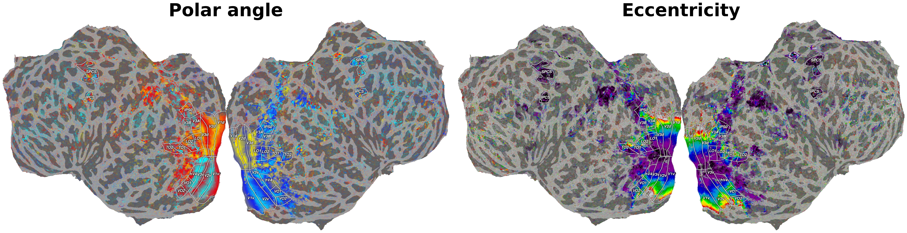
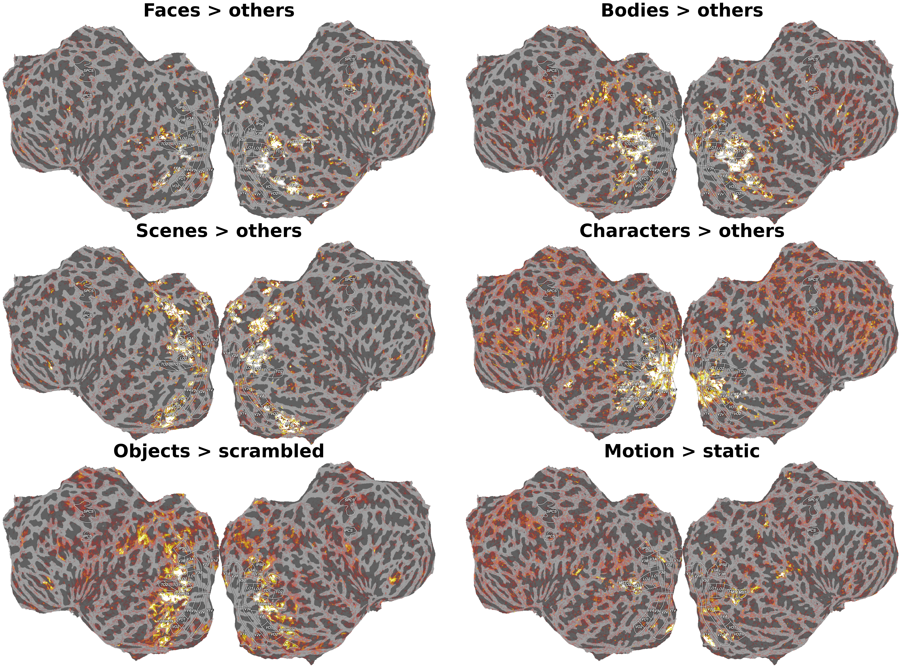
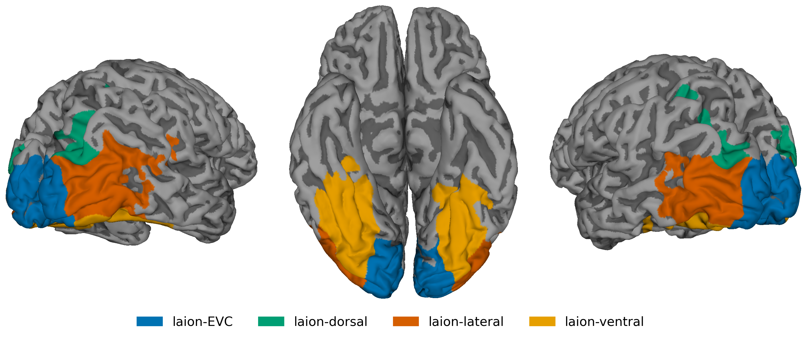

====
ROIs
====

ROI masks are provided for all subjects and cover retinotopically defined
visual areas, category-selective regions from functional localizers,
motion-selective areas, and visual-stream parcels. The ROIs are
provided as a suggested common reference for downstream analyses; the underlying
contrasts and retinotopic maps will be released too to enable alternative
definitions.

Available ROI Sets
==================

.. list-table::
   :widths: 22 35 20 23
   :header-rows: 1

   * - Set
     - ROIs
     - Source
     - Criterion
   * - **Retinotopic**
     - V1v, V1d, V2v, V2d, V3v, V3d, V3A, V3B, hV4, LO1, LO2,
       TO1, TO2, VO1, VO2, IPS0, SPCS, IPCS, EVC
     - Retinotopy localizer
     - Polar angle reversals, eccentricity gradients (R²-thresholded)
   * - **Face-selective**
     - OFA, FFA-1, FFA-2, pSTS-faces
     - fLoc
     - faces > others
   * - **Body-selective**
     - EBA, FBA
     - fLoc
     - bodies > others
   * - **Scene-selective**
     - PPA, OPA, MPA, SPL
     - fLoc
     - scenes > others
   * - **Character-selective**
     - VWFA-1, VWFA-2, mfs-words
     - fLoc
     - characters > others
   * - **Object-selective**
     - l-objects, v-objects
     - Object localizer
     - objects > scrambled
   * - **Motion**
     - MT, MST
     - Motion localizer
     - motion > static, ipsilateral > static
   * - **General visual selectivity**
     - laion-general
     - LAION main experiment
     - GLMsingle R²
   * - **Sectors of visual selectivity**
     - laion-EVC, laion-dorsal, laion-lateral, laion-ventral
     - Retinotopic ROIs + anatomical borders
     - Subdivision of laion-general

Functional ROIs
===============

Design Choices
---------------

All functional ROIs were manually delineated on the cortical surface.
Statistical maps informing the delineations, such as polar angle, or
localizer contrast t-statistics, were rendered as flatmaps via pycortex
[Gao2015]_ and annotated in Inkscape.

**Selection of ROIs.**
ROIs were included based on relevance to the field and consistent
identifiability across subjects.

**Mutual exclusivity.**
ROIs can overlap across sets but not within a set. For example, face-selective
FFA-1 may overlap with body-selective FBA, but not with face-selective FFA-2.

**Contrast thresholds.**
Contrast thresholds used in the definitions of ROIs vary across the field and are dependent on the statistical power of the experiment.
To accommodate different user preferences, we applied a liberal threshold at t>0 and relied on human judgment to identify steep drop-offs in functional preference.
The resulting ROIs may be larger than those reported in studies applying more conservative thresholds.
We will soon release the underlying t-statistic maps, allowing users to apply stricter thresholds within the
provided ROIs as their analyses require.

**Spurious activity in early visual cortex.**
Some category localizer contrasts yield significant responses in V1–V3,
likely reflecting low-level stimulus confounds rather than genuine category
selectivity. Such activations are excluded from all category-selective ROI
labels.

Retinotopy-derived ROIs
------------------------

Boundaries are traced on pRF parameter maps.

   Retinotopy-derived visual area ROIs.

*V1 / V2 / V3* are defined by successive polar-angle reversals and
released as separate dorsal (``*d``, lower visual field) and ventral (``*v``, upper
visual field) ROIs. *EVC* is the union of V1-V3, provided as a convenience mask for
analyses targeting early visual cortex as a whole.

.. note::

   *EVC* is not to be confused with *laion-EVC*.
   *laion-EVC* is restricted to vertices showing significant responses in the
   LAION experiment and is typically smaller than the retinotopically defined *EVC*.

*V3A / V3B* lie anterior to V3d near the transverse occipital sulcus. They
share a foveal representation; V3A on its medial side and V3B on its lateral side.

*IPS0* extends along the intraparietal sulcus from V3A/V3B, with a polar
angle progression from the upper vertical meridian (UVM) to the lower vertical meridian (LVM).

*hV4* sits lateral to V3v. The anterior boundary is an eccentricity reversal. hV4 contains a full
hemifield representation.

*VO1 / VO2* are anterior to hV4 on the ventral surface. They share
another foveal cluster and can be separated by a UVM representation.

*LO1 / LO2 / TO1 / TO2* cover the lateral occipitotemporal cortex. LO1 extends laterally from V3d. 
Each area contains a hemifield representation and their boundaries are defined by polar angle reversals. 
LO1 and LO2 share the foveal confluence of EVC whereas TO1 and TO2 contain a separate foveal representation.

*SPCS / IPCS* (superior and inferior precentral sulcus) are defined by
binarizing the population receptive field R² map without polar angle delineation; only clear
clusters on the precentral sulcus are labeled.

Localizer-derived ROIs
-----------------------

Localizer-derived ROIs are defined from the fLoc and motion localizer
experiments. For details on the localizer paradigms, see :doc:`localizers`.

   Localizer-derived category-selective ROIs.

**Face-selective (faces > others).**
*OFA* (IOG-faces) is on the inferior occipital gyrus, lateral to hV4. 
*FFA-1* (posterior fusiform, pFus-faces) and
*FFA-2* (mid-fusiform, mFus-faces) are on the fusiform gyrus: FFA-1 sits
posteriorly on the lateral fusiform gyrus; FFA-2 is a separable cluster anterior to FFA-1. 
*pSTS-faces* is on the posterior superior temporal sulcus (pSTS),
anterior to EBA, and kept separate from EBA.

**Body-selective (bodies > others).**
*EBA* is a large complex on the lateral occipitotemporal cortex surrounding
motion-selective MT/MST. 
*FBA* is on the fusiform gyrus lying approximately on the boundary of FFA-1 and FFA-2.

**Scene-selective (scenes > others).**
*PPA* is a contiguous cluster of selectivity along the collateral sulcus.
Separated clusters in VO1 are not included.
*OPA* lies around the transverse occipital sulcus.
*MPA* (also known as retrosplenial cortex, RSC) is in medial parietal cortex.
We tentatively delineate a fourth scene-selective area, *SPL*, on the superior parietal lobule, dorsal and
anterior to OPA. Bridging activations connecting MPA and OPA are discarded. 

**Character-selective (characters > others).**
*VWFA-1* is the first contiguous character-selective region in the
posterior occipitotemporal sulcus (pOTS) and surrounding banks. 
*VWFA-2* is the second character-selective region on the mid-occipitotemporal sulcus (mOTS).
Clusters of character-selective activation entirely outside the occipitotemporal sulcus
(OTS) are not labeled as VWFA. *mfs-words* is a mid-fusiform cluster distinct
from the OTS patches, labeled where identifiable.

**Object-selective (objects > scrambled).**
Object selectivity is subdivided into two mutually exclusive sectors using a coarse
lateral/ventral anatomical boundary: the inferior occipital–inferior temporal gyrus (IOG–ITG).
*l-objects* covers object-selective cortex on the lateral surface, dorsal to the IOG–ITG boundary
(~LO). *v-objects* covers object-selective cortex ventral to that boundary, on the
fusiform gyrus (~pFs), collateral sulcus, and neighboring banks.

**Motion-selective (motion > static; ipsilateral > static).**
*MT* (~TO1) sits on the posterior-ventral bank of the ascending limb of the inferior
temporal sulcus (ITS) and responds to contralateral stimulation only. 
*MST* (~TO2) sits on the anterior-dorsal bank of the same sulcus and has bilateral
receptive fields. MST is distinguished from MT through ipsilateral responsiveness; where the ipsilateral contrast is
inconclusive, the upper vertical meridian (the retinotopic TO1/TO2 boundary)
is used as a fallback to separate them.

General Visual Selectivity and Subdivisions
-------------------------------------------

   laion-general and its dorsal / lateral / ventral subdivisions.

*laion-general* covers all cortical regions showing visual responses
in the LAION experiment (GLMsingle R²), including isolated patches in IPS
and pSTS. *laion-EVC* comprises the intersection of the V1–V3 with the laion-general selectivity mask.

.. note::

   laion-EVC is not to be confused with the retinotopic *EVC* mask (union of V1–V3).
   laion-EVC is restricted to vertices showing significant responses in the
   LAION experiment and is typically smaller than the retinotopically defined *EVC*.

The remainder of laion-general is subdivided into three mutually exclusive
anatomical parcels: *laion-dorsal*, *laion-lateral*, and *laion-ventral*. These
parcels reflect broad cortical territories with anatomically drawn borders and
are not intended as functional stream definitions.

The following borders are defined via anatomical landmarks and retinotopy.

- **Posterior boundary** (shared with EVC): the outer border of V3 as defined
  by the retinotopic delineation.
- **Dorsal/lateral boundary**: runs roughly along the middle temporal gyrus
  (MTG), tracing the gap between retinotopic areas LO and V3A/V3B.
- **Lateral/ventral boundary**: runs along the inferior occipital–inferior
  temporal gyrus (IOG–ITG).

This yields three broad visual sectors:

- **laion-dorsal** - cortex dorsal to the LO–V3A/B boundary, covering dorsal
  occipital and parietal regions.
- **laion-lateral** - cortex between the MTG boundary (dorsal) and the IOG–ITG
  boundary (ventral), covering lateral occipitotemporal cortex.
- **laion-ventral** - cortex ventral to the IOG–ITG boundary, covering the
  ventral occipitotemporal surface.

Available Spaces
================

Per-subject ROIs are released in two spaces:

- **``fsnative``** - surface masks on each subject's FreeSurfer surface, as
  ``.func.gii`` (one value per vertex) and ``.label`` files, per hemisphere.
- **``T1w`` (1.8 mm)** - volumetric masks resampled to the subject's T1w grid
  at the functional resolution, as ``.nii.gz``.

Both spaces cover the same ROI sets. Surface masks are the canonical
reference; the T1w volumes are derived from them and provided for
convenience in volume-based analyses.

References
==========

.. [Gao2015] Gao JS, Huth AG, Lescroart MD and Gallant JL (2015) Pycortex:
   an interactive surface visualizer for fMRI. *Front. Neuroinform.* 9:23.
   doi: 10.3389/fninf.2015.00023

.. only:: dev

   File Organization
   =================

   .. todo::

      Paste the actual file tree from ``derivatives/rois/``.

   .. code-block:: text

       derivatives/rois/
       └── ... (placeholder - fill with actual file listing)

   Loading ROIs
   ============

   .. todo::

      Provide minimal code examples once file paths and naming are finalized.
      Show how to load an ROI mask and apply it to beta estimates
      (cross-ref :doc:`glmsingle_betas`).
