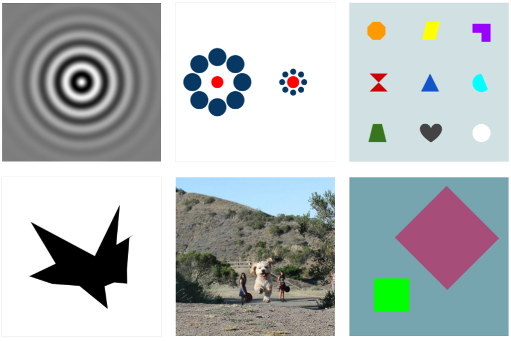
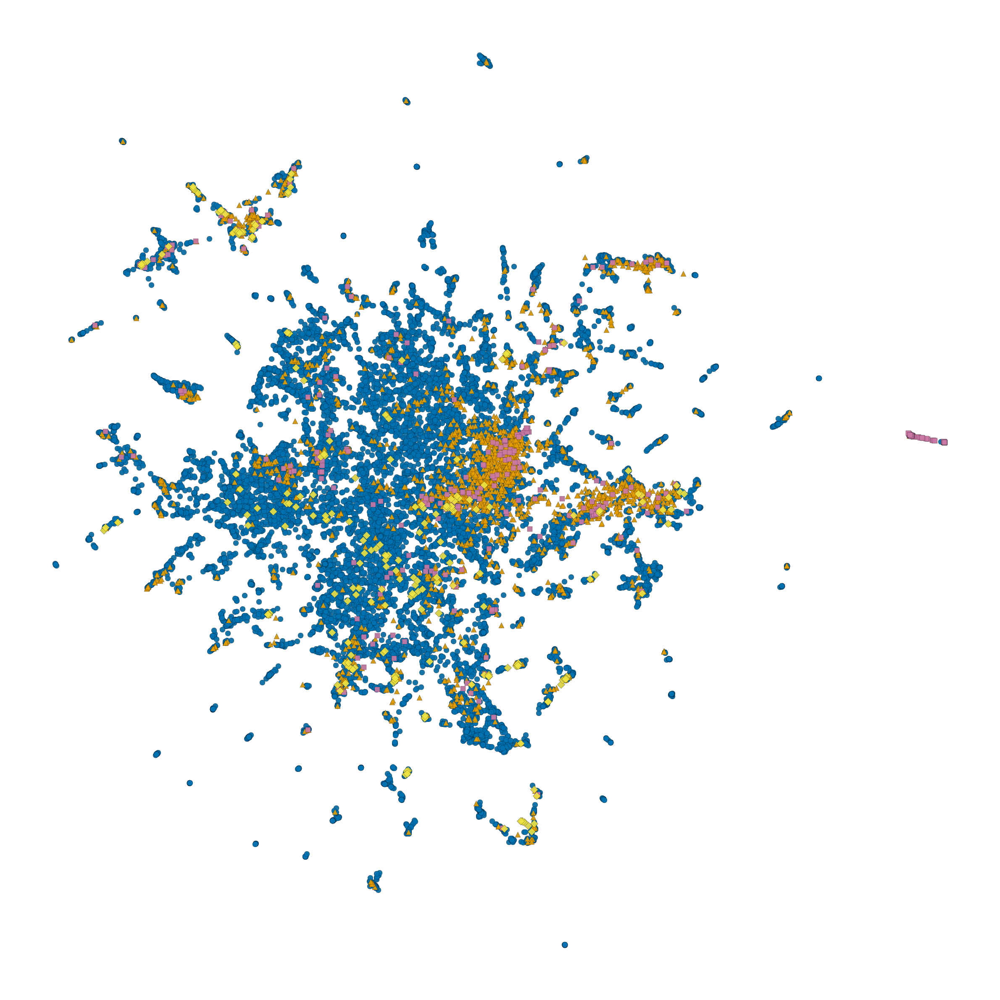

==============
Stimulus Data
==============

.. todo::

   Introductory narrative (2-3 sentences): What stimuli are provided, how
   many, and for which experiments (main experiment, localizer, etc.)?
   Cross-reference :doc:`stimulus_selection` for how they were chosen.

.. todo::

   Add a large montage / grid figure showing a representative sample of
   stimuli from the dataset (e.g., 50-100 random images in a grid).

.. figure:: _static/placeholder_stimulus_montage.png
   :align: center
   :width: 90%
   :alt: Montage of example stimuli

   A representative sample of stimuli from the LAION-fMRI dataset.
   *(placeholder — replace with actual figure)*

Stimulus Sets
=============

.. todo::

   List all stimulus sets included in the dataset (main experiment,
   localizer, n-back, etc.). For each set: how many images, what kind of
   images, what experiment they belong to.

File Organization
=================

.. todo::

   Paste the actual directory tree under ``stimuli/``.

.. code-block:: text

    stimuli/
    └── ... (placeholder — fill with actual file listing)

   Example stimuli from different categories in the LAION-fMRI dataset.

Image Format
============

.. todo::

   Document the technical specs of the image files:

   - File format (PNG, JPEG, etc.)
   - Resolution (pixels)
   - Color space and bit depth
   - Any preprocessing applied (cropping, resizing, background)

Stimulus Metadata
=================

For details on how the metadata was collected and computed (visual properties,
semantic annotations, model-derived features), see
:doc:`metadata_acquisition`.

.. todo::

   Document the ``stimuli.tsv`` file:

   - List every column and what it contains
   - Show a few example rows (copy from the actual file)
   - Document the companion ``stimuli.json`` sidecar if one exists

Distribution of Stimuli
=======================

   Distribution of stimuli across categories in the LAION-fMRI dataset.

.. todo::

   Add a brief description of what this figure shows. If there are additional
   useful distribution plots (by visual properties, by source, etc.), add them.

Loading Stimulus Data
=====================

.. todo::

   Provide minimal code examples for:

   1. Loading the metadata TSV
   2. Loading an image file
   3. Mapping stimulus IDs to beta indices (cross-ref :doc:`glmsingle_betas`)

   If the ``laion-fmri-dataloader`` Python package has a stable API, show
   examples using it. Otherwise, show plain pandas + PIL.

See also :doc:`train_test_splits` for how stimuli are partitioned into
training and test sets.

