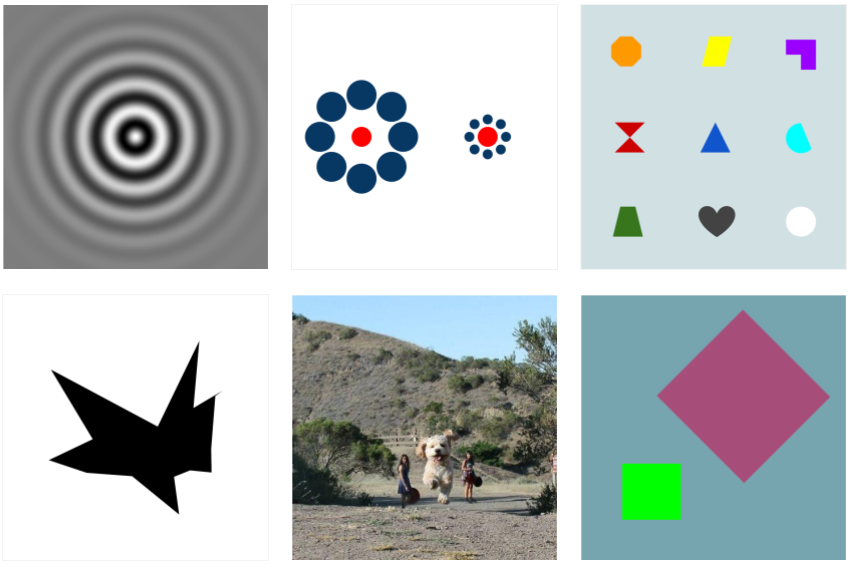
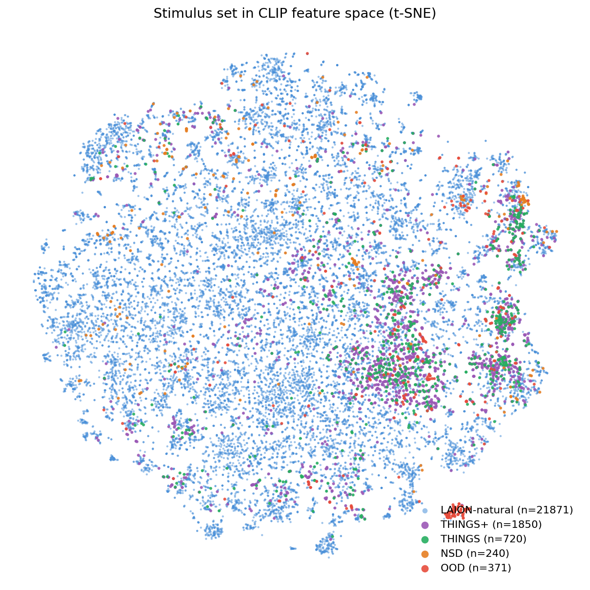

==============
Stimulus Data
==============

.. todo::

   Introductory narrative (2-3 sentences): What stimuli are provided, how
   many, and for which experiments (main experiment, localizer, etc.)?
   Cross-reference :doc:`stimulus_selection` for how they were chosen.

.. todo::

   Add a large montage / grid figure showing a representative sample of
   stimuli from the dataset (e.g., 50-100 random images in a grid).

.. figure:: _static/placeholder_stimulus_montage.png
   :align: center
   :width: 90%
   :alt: Montage of example stimuli

   A representative sample of stimuli from the LAION-fMRI dataset.
   *(placeholder — replace with actual figure)*

Stimulus Sets
=============

.. todo::

   List all stimulus sets included in the dataset (main experiment,
   localizer, n-back, etc.). For each set: how many images, what kind of
   images, what experiment they belong to.

File Organization
=================

.. todo::

   Paste the actual directory tree under ``stimuli/``.

.. code-block:: text

    stimuli/
    └── ... (placeholder — fill with actual file listing)

   Example stimuli from different categories in the LAION-fMRI dataset.

Image Format
============

.. todo::

   Document the technical specs of the image files:

   - File format (PNG, JPEG, etc.)
   - Resolution (pixels)
   - Color space and bit depth
   - Any preprocessing applied (cropping, resizing, background)

Stimulus Metadata
=================

For details on how the metadata was collected and computed (visual properties,
semantic annotations, model-derived features), see
:doc:`metadata_acquisition`.

.. todo::

   Document the ``stimuli.tsv`` file:

   - List every column and what it contains
   - Show a few example rows (copy from the actual file)
   - Document the companion ``stimuli.json`` sidecar if one exists

Stimulus Embeddings
===================

For every stimulus image in the dataset (25,052 in total, including the
OOD set), pretrained image embeddings from four widely used vision models
are provided as a convenience for downstream analyses. The embeddings are
stored as four HDF5 files, one per model, sitting next to the stimulus
images themselves:

.. code-block:: text

   stimuli/
   ├── task-images_stimuli.h5          # the images
   ├── task-images_metadata.csv        # image-level metadata
   ├── task-images_desc-CLIP_embeddings.h5
   ├── task-images_desc-DINOv2_embeddings.h5
   ├── task-images_desc-PEcore_embeddings.h5
   └── task-images_desc-SigLIP2_embeddings.h5

The four models are:

.. list-table::
   :widths: 15 30 15 40
   :header-rows: 1

   * - ``desc-`` label
     - Model
     - Feature dim
     - Notes
   * - ``CLIP``
     - OpenCLIP LAION ViT-H/14
     - 1024
     - L2-normalised
   * - ``DINOv2``
     - DINOv2 ViT-L/14
     - 1024
     - Mean-pooled patch tokens from layer 23; not normalised
   * - ``PEcore``
     - PE Core L/14, 336 px
     - 1024
     - L2-normalised
   * - ``SigLIP2``
     - SigLIP2 SO400M Patch14, 384 px
     - 1152
     - L2-normalised

Each file has the same layout — a flat HDF5 with three datasets of
length 25,052:

.. code-block:: text

   embedding   # (25052, feature_dim) float16
   image_ids   # (25052,) variable-length strings — image filenames
   valid       # (25052,) bool — True for every image in release-main

Rows in ``embedding`` correspond one-to-one to entries in ``image_ids``,
and all four files share the same ``image_ids`` order. To work with a
specific subject's stimuli, intersect ``image_ids`` with the
``image_name`` column of the stimulus metadata (filtered to that
subject's images).

Loading them with the package:

.. code-block:: python

   import laion_fmri

   stim = laion_fmri.load_stimuli()
   stim.embeddings.models                    # ['CLIP', 'DINOv2', 'PEcore', 'SigLIP2']
   stim.embeddings["CLIP"]                   # (25052, 1024) float16 array
   stim.embeddings.get(
       "CLIP", "shared_12rep_LAION_cluster_1003_i0.jpg",
   )                                         # one vector

   # Trial-aligned access from the subject side:
   sub = laion_fmri.load_subject(1)
   sub01_clip = sub.embeddings.all("CLIP")   # (n_trials, 1024)

Object Segmentations
====================

Every **shared** stimulus image carries object-level segmentation
masks: for each noun the detector found in the image, one binary
mask per detected instance (e.g. four ``hand`` masks for an image
with four visible hands). These are useful for asking questions
like "did the subject see a face on this trial?" or for spatially
restricting analyses to image regions.

.. note::

   Segmentations are provided **for the shared stimulus set only**
   (1,492 images viewed by every subject). Subject-unique images do
   not carry masks. The listing methods (``nouns``, ``for_image``)
   return empty results -- not errors -- for uncovered images.

Files on disk:

.. code-block:: text

   stimuli/
   ├── task-images_desc-segmentations.h5            # (24011, 1000, 1000) uint8
   └── task-images_desc-segmentations_metadata.csv  # one row per mask

The HDF5 holds a single ``masks`` dataset, gzip-compressed with the
byte-shuffle filter so the file ships at ~68 MB despite 24,000+
masks. The sidecar CSV maps each ``mask_row`` to an
``(image_name, noun, instance_id)`` triple, with detection score,
bounding box, and a ``localized`` flag that is ``0`` when the
detector flagged a concept but couldn't bound it spatially
(rare; safe to filter out with ``localized == 1``).

Download and load:

.. code-block:: python

   import laion_fmri

   laion_fmri.download_segmentations()       # ~68 MB, public, no DUA

   stim = laion_fmri.load_stimuli()

   # What nouns are present in this image?
   stim.segmentations.nouns(
       "shared_12rep_LAION_cluster_1003_i0.jpg",
   )                                         # ['fingers', 'hand', ...]

   # Fetch one mask:
   mask = stim.segmentations.get(
       "shared_12rep_LAION_cluster_1003_i0.jpg",
       "fingers",
       instance=0,
   )                                         # (1000, 1000) uint8

Subject-level trial access works the same way, with the trial index
in place of the image name:

.. code-block:: python

   sub = laion_fmri.load_subject(1)
   sub.segmentations.nouns(42)               # nouns shown on trial 42
   sub.segmentations.has_image(42)           # False for unique-image trials
   sub.segmentations.get(42, "fingers")      # mask for trial 42

Distribution of Stimuli
=======================

   Distribution of stimuli across categories in the LAION-fMRI dataset.

.. todo::

   Add a brief description of what this figure shows. If there are additional
   useful distribution plots (by visual properties, by source, etc.), add them.

Loading Stimulus Data
=====================

.. todo::

   Provide minimal code examples for:

   1. Loading the metadata TSV
   2. Loading an image file
   3. Mapping stimulus IDs to beta indices (cross-ref :doc:`glmsingle_betas`)

   If the ``laion-fmri-dataloader`` Python package has a stable API, show
   examples using it. Otherwise, show plain pandas + PIL.

See also :doc:`train_test_splits` for how stimuli are partitioned into
training and test sets.

