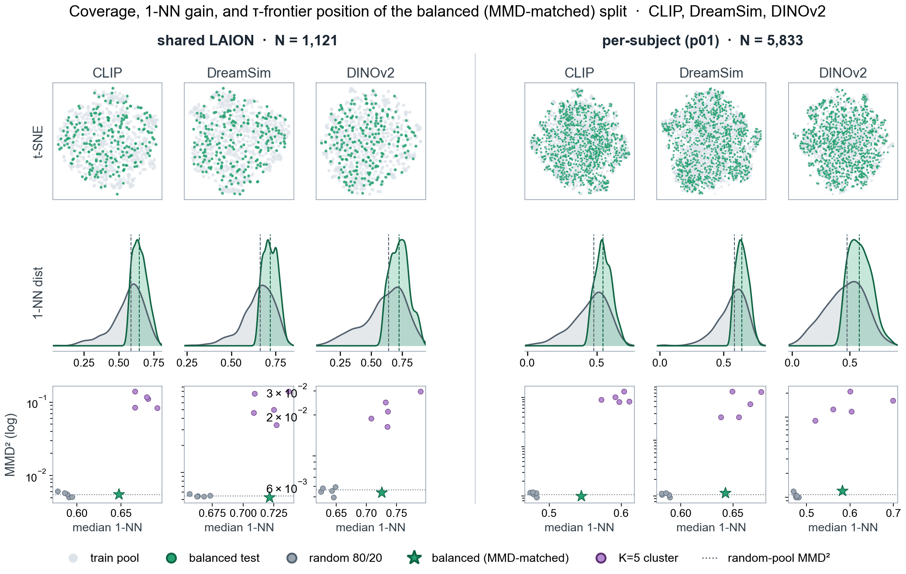

===================
Train / Test Splits
===================

LAION-fMRI ships with **predefined train/test splits** so that
encoding-model and representation-similarity replications can
report comparable generalization scores. The splits implement
*Method 1* and *Method 2* of the
`re:vision generalization framework <https://re-vision-initiative.org/generalization/>`_:

* **Method 1 — Independent within-distribution.** An 80/20 split
  that covers the image distribution as fully as possible while
  penalising train/test pairs that are too close in feature
  space. Use the ``tau`` split.
* **Method 2 — Out-of-distribution clusters.** Five-fold
  CLIP-feature cluster holdout. Use the ``cluster_k5_0`` …
  ``cluster_k5_4`` splits and average results across folds.
* **Random** baselines (``random_0`` … ``random_4``) are also
  bundled — comparing them against ``tau`` quantifies how much
  of a model's score depends on train/test similarity.

OOD images (re:vision *Method 3*) are a separate stimulus set,
not a partition of any pool — see :doc:`stimulus_data`.

   Cross-pool diagnostics for the ``tau`` split, on two
   representative pools (left: cross-subject ``shared``;
   right: ``sub-01``). Each block is 3 × 3 — rows are
   diagnostics, columns are the three feature spaces used to
   construct the splits (CLIP, DINOv2, DreamSim).
   **Row 1, t-SNE coverage:** test images (green) overlaid on
   the training pool (grey); ``tau`` test points spread across
   the embedding rather than concentrating in one region.
   **Row 2, 1-NN density:** kernel density of each test image's
   distance to its nearest *training* neighbour, ``tau``
   (green) vs the random baseline (grey); dashed lines mark
   medians. ``tau`` shifts the distribution toward larger NN
   distances — i.e. a *harder* test set than random — while
   keeping the population matched at the MMD level.
   **Row 3, τ-frontier:** the population-level discrepancy
   (squared MMD between train and test, log scale) as the
   minimum-NN feasibility threshold τ is swept from permissive
   to tight. The blue curve is the best-of-3000 candidate at
   each τ; grey dots are the five ``random_*`` baselines, purple
   dots the five ``cluster_k5_*`` folds, and the green star is
   the bundled ``tau`` split — chosen at the tightest τ whose
   MMD still matches the random baseline.

Pools
=====

Every split is bundled for **six pools**. Pick the one whose
stimulus subset matches the original study:

* ``"shared"`` — the **1,121 cross-subject shared images** (non-OOD
  subset of the shared block). Use this when the original study
  used only stimuli that every subject saw (e.g. NSD- or
  Conwell-style benchmarks).
* ``"sub-01"``, ``"sub-03"``, ``"sub-05"``, ``"sub-06"``, ``"sub-07"``
  — the per-subject pools (1,121 shared + 4,712 subject-unique
  images = **5,833 images each**). Use a subject's pool when the
  original analysis was per-subject and used that subject's full
  stimulus set.

Split names
===========

Eleven names exist in every pool:

.. list-table::
   :header-rows: 1
   :widths: 30 20 50

   * - name
     - re:vision method
     - notes
   * - ``random_0`` … ``random_4``
     - baseline
     - Five seeded uniform-random 80/20 partitions. Use them as a
       baseline for any generalization metric.
   * - ``cluster_k5_0`` … ``cluster_k5_4``
     - Method 2
     - Each split holds out one of five CLIP-feature k-means
       clusters as the test fold. Test sizes vary with cluster
       population; train + test always sum to the pool.
   * - ``tau``
     - Method 1
     - The MMD-matched 80/20 nearest-neighbour-distance split.
       Train and test match at the population level (low MMD),
       but each test image is kept maximally far from its
       nearest training neighbour in feature space. Single
       fixed split per pool.

Split sizes:

* ``random_*`` and ``tau`` are fixed at 80/20 of the pool — that's
  897 / 224 for the shared pool and 4666 / 1167 per subject.
* ``cluster_k5_*`` test sizes vary with cluster population; train
  + test always equals the pool size.

Loading splits
==============

The simplest path is :func:`laion_fmri.splits.get_train_test_ids`,
which returns the train and test image-id lists. Match those
against the ``label`` column of any trial table, then apply the
mask to your betas:

.. code-block:: python

   import numpy as np
   import pandas as pd
   from laion_fmri.subject import load_subject
   from laion_fmri.splits import get_train_test_ids

   sub = load_subject("sub-01")

   # Load betas and trial info as usual (see laion_fmri_package/load).
   sessions = sub.get_sessions()
   betas_per_ses  = sub.get_betas(session=sessions, roi="hlvis")
   trials_per_ses = sub.get_trial_info(session=sessions)

   # Concatenate across sessions (standard idiom).
   betas  = np.concatenate(list(betas_per_ses.values()), axis=0)
   trials = pd.concat(list(trials_per_ses.values()), ignore_index=True)

   # Method 1: within-distribution generalization on the shared pool.
   train_ids, test_ids = get_train_test_ids("tau", pool="shared")
   train_mask = trials["label"].isin(train_ids).to_numpy()
   test_mask  = trials["label"].isin(test_ids).to_numpy()

   X_train, X_test = betas[train_mask], betas[test_mask]

Matching is by string equality: ``train_ids`` / ``test_ids``
are the same strings as the ``label`` column entries (e.g.
``"shared_12rep_LAION_cluster_1003_i0.jpg"``), so no
normalisation is needed.

For convenience, :func:`laion_fmri.splits.get_split_masks`
collapses those last three lines:

.. code-block:: python

   from laion_fmri.splits import get_split_masks

   train_mask, test_mask = get_split_masks(trials, "tau", pool="shared")
   X_train, X_test = betas[train_mask], betas[test_mask]

Method 2 — five-fold cluster average
====================================

.. code-block:: python

   from laion_fmri.splits import get_split_masks

   scores = []
   for k in range(5):
       train_mask, test_mask = get_split_masks(
           trials, f"cluster_k5_{k}", pool="shared",
       )
       fit_encoding(features[train_mask], betas[train_mask])
       scores.append(score(features[test_mask], betas[test_mask]))

   m2 = float(np.mean(scores))

Inspection
==========

For the full :class:`~laion_fmri.splits.Split` object — including
``splitter`` / ``params`` / variant metadata — use
:func:`~laion_fmri.splits.load_split`:

.. code-block:: python

   >>> from laion_fmri.splits import list_pools, list_splits, load_split
   >>> list_pools()
   ['shared', 'sub-01', 'sub-03', 'sub-05', 'sub-06', 'sub-07']
   >>> list_splits()
   ['random_0', ..., 'cluster_k5_4', 'tau']
   >>> sp = load_split("tau", pool="shared")
   >>> sp.n_train, sp.n_test, sp.split_family
   (897, 224, 'tau')
   >>> sp.params
   {'method': 'min_nn_filter + stochastic_mmd_swap', ...}

Split file schema
=================

The bundled JSONs live under ``laion_fmri/splits/data/{pool}/`` and
are accessed transparently by the loaders above. Schema, for
reference:

.. code-block:: json

    {
      "name": "random_0",
      "pool": "sub-01 full pool (unique + LAION non-OOD shared)",
      "splitter": "min_nn_stochastic",
      "params": { "method": "uniform_random", "seed": 0 },
      "n_train": 4666,
      "n_test":  1167,
      "variants": [
        {
          "variant_id": 0,
          "train_ids":  ["shared_12rep_LAION_cluster_1003_i0.jpg", "..."],
          "test_ids":   ["unique_LAION_initial_cluster_2817_i38_p01.jpg", "..."]
        }
      ]
    }

See also
========

* :doc:`stimulus_data` — how stimulus filenames map to dataset labels.
* :doc:`glmsingle_betas` — per-trial beta estimates the splits slice into.
* :doc:`laion_fmri_package/load` — the ``Subject`` accessors used above.
